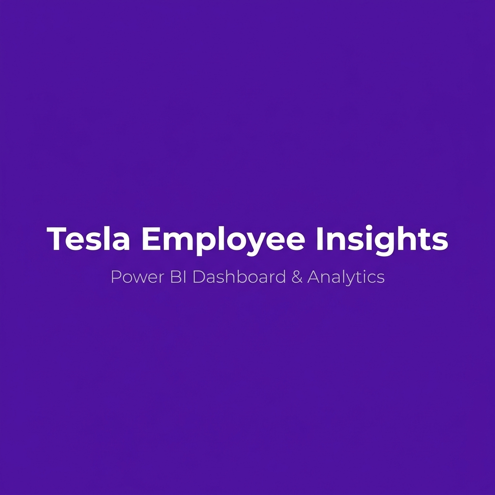
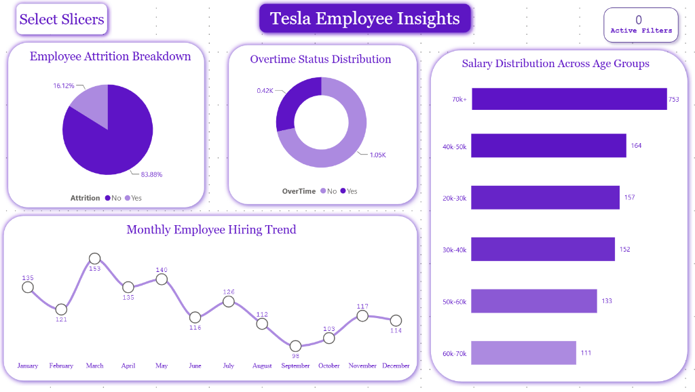
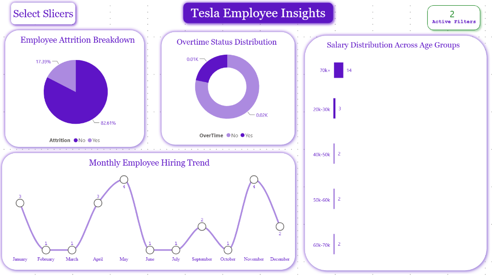
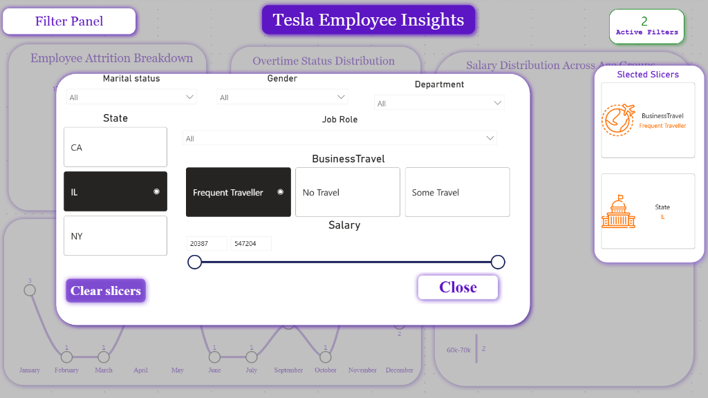
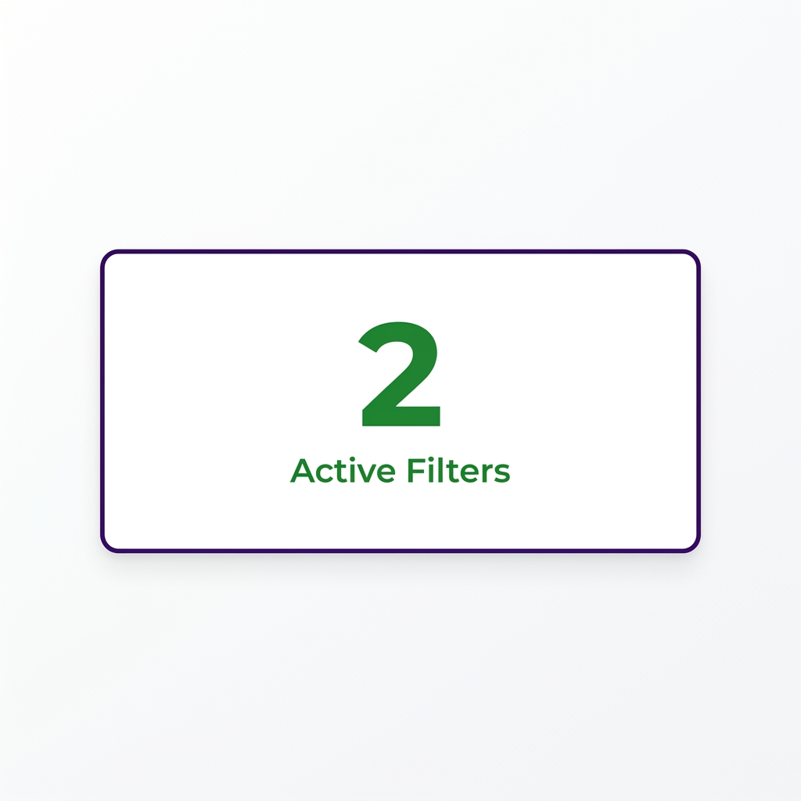

<p align="center">
  
</p>

<h1 align="center">⚡ Tesla Employee Insights Dashboard</h1>

<p align="center">
  <strong>An advanced Power BI dashboard featuring a dynamic filtering system that transforms how HR teams analyze employee attrition, compensation, overtime, and hiring trends at scale.</strong>
</p>

<p align="center">
  
  
  
  
  
</p>

<p align="center">
  <a href="#-dashboard-preview">Preview</a> •
  <a href="#-key-features">Features</a> •
  <a href="#-dynamic-filtering-system">Filtering System</a> •
  <a href="#-business-questions-answered">Business Value</a> •
  <a href="#-documentation">Docs</a> •
  <a href="#-getting-started">Get Started</a>
</p>

> [!IMPORTANT]
> **Disclaimer**: This project is created for learning and portfolio purposes. The dataset is synthetic/anonymized and does not represent actual Tesla employee data.

---

## 📋 Project Overview

The **Tesla Employee Insights Dashboard** is a production-grade Power BI solution designed for HR analytics teams who need real-time, interactive workforce intelligence. Unlike conventional dashboards that present static snapshots, this project demonstrates an **advanced Dynamic Filtering System** where multiple slicers interact together and instantly update every visual on the page — enabling rapid hypothesis testing and data-driven decision making.

### Why This Dashboard Was Built

Traditional HR reporting relies on static spreadsheets and pre-built reports that can't answer ad-hoc questions. When a CHRO asks *"What's the attrition rate among overtime-eligible engineers in California earning above $60k?"*, the typical response is *"Let me pull that for next week."*

This dashboard delivers that answer in **under 3 seconds** — with zero IT involvement.

### Who Can Use It

| Role | Use Case |
|------|----------|
| **Chief HR Officer** | Executive-level attrition and compensation overview |
| **HR Business Partners** | Department-level workforce analysis with dynamic drill-down |
| **Compensation Analysts** | Salary distribution and equity analysis across demographics |
| **Talent Acquisition** | Monthly hiring trend analysis and pipeline optimization |
| **Department Managers** | Team-specific headcount, overtime, and retention metrics |
| **Data Analysts / BI Developers** | Reference architecture for advanced slicer implementations |

---

## 📸 Dashboard Preview

<p align="center">
  
</p>

<p align="center"><em>Dashboard showing Employee Attrition Breakdown, Overtime Distribution, Salary Analysis, and Monthly Hiring Trends with the Dynamic Filter System.</em></p>

<details>
<summary><strong>🔍 View More Screenshots</strong></summary>

### Filtered View — Dynamic Filtering in Action
<p align="center">
  
</p>

### Slicer Panel — Interactive Filter Selection
<p align="center">
  
</p>

### Active Filter Counter — Real-Time Filter Tracking
<p align="center">
  
</p>

</details>

---

## ⭐ Key Features

### ⭐ Advanced Dynamic Filtering System

> **This is the primary feature of this dashboard — not the charts.**

The Dynamic Filtering System is a custom-built slicer architecture that goes far beyond Power BI's default filtering capabilities:

| Capability | Implementation |
|-----------|---------------|
| **Cross-Filtering** | Every visual has `drillFilterOtherVisuals: true`, enabling click-on-chart interactions to filter the entire dashboard |
| **Interactive Slicers** | 7 hidden slicers (Department, Gender, Job Role, Business Travel, Marital Status, Salary Range, State) controlled through a custom slicer panel |
| **Slicer Visibility Control** | A disconnected `Slicer_tabel` table with `Slicer_Visibility_Control` DAX measure that shows/hides slicers based on user selection |
| **Synchronized Filtering** | `syncGroup` named "slicer" ensures the main page and tooltip slicer panel stay in perfect sync |
| **Dynamic Slicer Icons** | `Slicer_Image` measure renders custom icons for each slicer option |
| **Conditional Formatting** | `Slicer_Font_Color` measure changes slicer label colors based on selection state |
| **Active Filter Counter** | `Slicer count` measure displayed in an action button, showing the number of currently applied filters in real-time |
| **Dynamic Color Feedback** | `button text color` measure changes the filter counter's color to provide visual feedback when filters are active |

```
User clicks "Select Slicers" → Slicer Panel appears (via Bookmark)
    → User selects "Department" → Slicer_Visibility_Control = 1
        → Department dropdown slicer becomes visible
            → User selects "Engineering"
                → All 4 charts instantly update
                    → Active Filter Counter changes from 0 → 1
                        → Counter color changes to indicate active filtering
```

📖 **[Full Dynamic Filter System Documentation →](docs/dynamic-filter-system.md)**

---

### 📊 Employee Attrition Breakdown

A **pie chart** visualizing attrition distribution (Yes vs. No) by employee count, with percentage-of-total labels. Custom purple color coding distinguishes retained employees (`#5E14C6`) from departed employees (`#AC8AE0`).

### 🕐 Overtime Status Distribution

A **donut chart** breaking down overtime participation (Yes vs. No), displaying employee counts in thousands. Enables instant correlation between overtime and attrition when cross-filtered.

### 💰 Salary Distribution Across Age Groups

A dual **clustered bar chart** system — the main chart uses a **gradient fill** from light purple (`#AC8AE0`) to deep purple (`#5C15C4`) for salary ranges 30k–70k, while a separate top bar highlights the 70k+ category. This split design provides focused analysis of high earners versus the broader distribution.

### 📈 Monthly Employee Hiring Trend

A **smooth line chart** plotting employee hires by month using the HireDate hierarchy. Features custom markers (size 12), a 4px stroke width, and Courier New data labels for a distinctive visual identity.

### 🎯 Executive Dashboard Layout

The dashboard uses **visual groups** to organize content into logical sections:

- **Pie Group** — Employee Attrition Breakdown
- **Donut Group** — Overtime Status Distribution
- **Bar Chart Group** — Salary Distribution (dual chart)
- **Line Chart Group** — Monthly Hiring Trend
- **Group 3** — Active Filter Counter area

### 🖱️ Interactive User Experience

- **Click any chart segment** to cross-filter all other visuals
- **"Select Slicers" button** opens the filter panel via bookmark navigation
- **Visual link** on the active filter counter for quick navigation
- **Tooltip page** provides the slicer panel as a hover experience
- **Purple glow and shadow effects** on interactive elements for visual polish

---

## 💡 Business Questions Answered

This dashboard enables HR leaders to answer critical workforce questions instantly:

| # | Business Question | Visual(s) Used |
|---|-------------------|---------------|
| 1 | What is our overall employee attrition rate? | Pie Chart |
| 2 | How many employees work overtime vs. standard hours? | Donut Chart |
| 3 | What is the salary distribution across the organization? | Clustered Bar Chart |
| 4 | How has our hiring volume changed month-over-month? | Line Chart |
| 5 | Is there a correlation between overtime and attrition? | Pie + Donut (cross-filter) |
| 6 | Which departments have the highest attrition? | All visuals + Department slicer |
| 7 | Do high-salary employees leave at lower rates? | Bar Chart + Pie (cross-filter) |
| 8 | How does attrition differ by gender? | All visuals + Gender slicer |
| 9 | What's the attrition rate for frequent travelers? | All visuals + Business Travel slicer |
| 10 | Which states have the most employees in each salary bracket? | Bar Chart + State slicer |
| 11 | Are married employees more likely to stay? | All visuals + Marital Status slicer |
| 12 | What job roles show the highest overtime rates? | Donut + Job Role slicer |
| 13 | How many filters are currently applied to the view? | Active Filter Counter |
| 14 | What's the hiring trend for a specific department? | Line Chart + Department slicer |
| 15 | How does salary distribution vary by job role? | Bar Chart + Job Role slicer |

---

## 🛠️ Technology Stack

| Technology | Purpose |
|-----------|---------|
| **Power BI Desktop** | Report development, visual design, and data modeling |
| **DAX (Data Analysis Expressions)** | Custom measures for dynamic filtering, slicer control, conditional formatting, and active filter counting |
| **Power Query (M Language)** | Data ingestion, cleaning, type transformations, and column derivation |
| **Star Schema Data Model** | Optimized relational model with fact table (Employee) and dimension tables (EducationLevel, PerformanceRating, RatingLevel, SatisfiedLevel, Months) |
| **Disconnected Tables** | `Slicer_tabel` for dynamic slicer control without direct data relationships |
| **Bookmark Navigation** | Slicer panel show/hide functionality |
| **syncGroup** | Cross-page slicer synchronization |
| **Advanced Slicer Visual** | Custom slicer rendering with images, conditional labels, and visibility control |

---

## 📂 Repository Structure

```
tesla-employee-insights-dashboard/
│
├── 📄 README.md                              # This file
├── 📄 LICENSE                                 # MIT License
├── 📄 .gitignore                              # Git ignore rules
├── 📊 Tesla Employee Insights.pbix            # Power BI dashboard file
│
├── 🖼️ assets/
│   ├── banner.png                             # Repository banner image
│   └── screenshots/
│       ├── dashboard-overview.png             # Full dashboard view
│       ├── default-view.png                   # Default unfiltered state
│       ├── filtered-view.png                  # Dashboard with active filters
│       ├── active-filter-counter.png          # Filter counter close-up
│       └── slicer-panel.png                   # Dynamic slicer panel
│
├── 📚 docs/
│   ├── business-problem.md                    # Business context and problem statement
│   ├── dashboard-guide.md                     # Visual-by-visual guide
│   ├── dynamic-filter-system.md               # ⭐ Dynamic filtering architecture
│   ├── architecture.md                        # System architecture with diagrams
│   ├── data-model.md                          # Data model and relationships
│   ├── dax-reference.md                       # DAX measure documentation
│   ├── data-dictionary.md                     # Column-level data dictionary
│   ├── interview-prep.md                      # 40 interview Q&A
│   ├── performance-optimization.md            # Performance tuning guide
│   └── future-enhancements.md                 # Roadmap and enhancements
│
└── 📁 data-sample/
    └── tesla-employee-sample.csv              # Anonymized 50-row sample dataset
```

---

## 📚 Documentation

| Document | Description |
|----------|-------------|
| [⭐ Dynamic Filter System](docs/dynamic-filter-system.md) | **Most important doc** — Complete architecture of the slicer control system, cross-filtering, syncGroup, and active filter counter |
| [Business Problem](docs/business-problem.md) | Why HR departments need interactive analytics and how this dashboard solves real problems |
| [Dashboard Guide](docs/dashboard-guide.md) | Visual-by-visual walkthrough with purpose, business value, and insights for each chart |
| [Architecture](docs/architecture.md) | End-to-end system architecture with Mermaid diagrams |
| [Data Model](docs/data-model.md) | Star schema design, table relationships, cardinality, and optimization |
| [DAX Reference](docs/dax-reference.md) | Every DAX measure documented with formula, purpose, and optimization notes |
| [Data Dictionary](docs/data-dictionary.md) | Column-level definitions with data types, examples, and business purpose |
| [Interview Prep](docs/interview-prep.md) | 40 Power BI interview questions with detailed answers |
| [Performance Optimization](docs/performance-optimization.md) | Model, query, visual, and DAX optimization techniques |
| [Future Enhancements](docs/future-enhancements.md) | Roadmap including AI visuals, RLS, predictive analytics, and more |

---

## 🚀 Getting Started

### Prerequisites

- **Power BI Desktop** (latest version recommended)
- Windows 10/11

### Installation

1. **Clone this repository**
   ```bash
   git clone https://github.com/yourusername/tesla-employee-insights-dashboard.git
   ```

2. **Open the dashboard**
   - Launch Power BI Desktop
   - Open `Tesla Employee Insights.pbix`

3. **Explore the Dynamic Filtering System**
   - Click **"Select Slicers"** (top-left) to open the filter panel
   - Select a slicer category to reveal the corresponding dropdown
   - Make selections and watch all visuals update instantly
   - Monitor the **Active Filter Counter** to track applied filters

### Using the Sample Data

The `data-sample/tesla-employee-sample.csv` file contains 50 anonymized employee records matching the dashboard schema. Use it to understand the data structure or build your own version.

---

## 🎨 Design Language

| Element | Value |
|---------|-------|
| **Primary Color** | `#5E14C6` (Deep Purple) |
| **Secondary Color** | `#AC8AE0` (Light Purple) |
| **Accent Color** | `#5D14C3` (Purple) |
| **Title Font** | Georgia |
| **Data Label Font** | Courier New |
| **Dashboard Dimensions** | 1280 × 720px |
| **Display Mode** | Fit to Page |

---

## 🔮 Future Enhancements

| Enhancement | Complexity | Impact |
|-------------|-----------|--------|
| Predictive Attrition Model | 🔴 High | AI-powered risk scoring for each employee |
| Key Influencers Visual | 🟡 Medium | Automated insight discovery for attrition drivers |
| Row-Level Security | 🟡 Medium | Department-based data access control |
| Drillthrough Pages | 🟢 Low | Employee-level detail from any chart click |
| Mobile Layout | 🟢 Low | Responsive design for phone/tablet |
| Power BI Service Deployment | 🟡 Medium | Scheduled refresh, sharing, and embedded analytics |

📖 **[Full Enhancement Roadmap →](docs/future-enhancements.md)**

---

## 📝 License

This project is licensed under the **MIT License** — see the [LICENSE](LICENSE) file for details.

---

## 🤝 Contributing

Contributions are welcome! If you have suggestions for improving the dynamic filtering system, adding new DAX patterns, or enhancing the documentation:

1. Fork this repository
2. Create a feature branch (`git checkout -b feature/new-enhancement`)
3. Commit your changes (`git commit -m 'Add predictive attrition model'`)
4. Push to the branch (`git push origin feature/new-enhancement`)
5. Open a Pull Request

---

## 📬 Contact

If you have questions about the Dynamic Filtering System implementation or want to discuss Power BI best practices, feel free to open an issue or reach out.

---

<p align="center">
  <strong>Built with ⚡ Power BI | Designed for HR Excellence</strong>
</p>

<p align="center">
  
  
  
</p>
