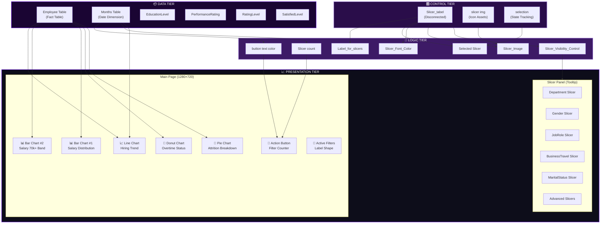
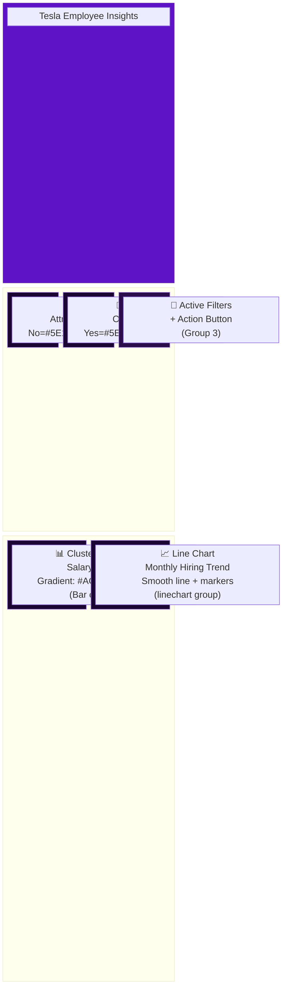
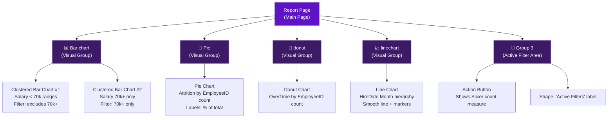
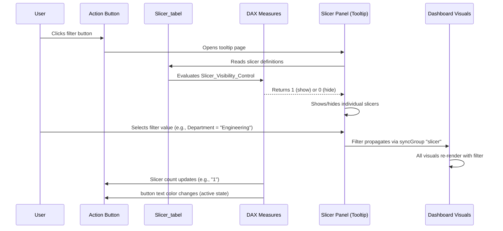
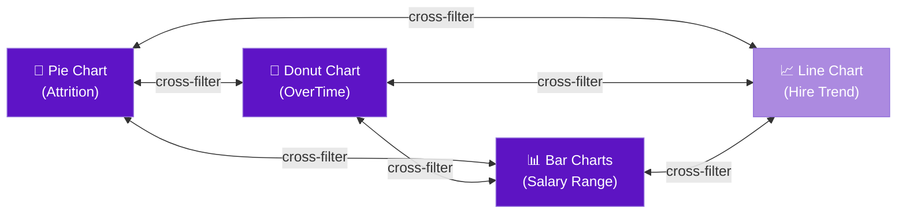

# 🏗️ Tesla Employee Insights — Architecture Reference

> **Dashboard**: Tesla Employee Insights  
> **Platform**: Microsoft Power BI Desktop  
> **Canvas**: 1280 × 720 px (Main Page) + Tooltip Slicer Panel  
> **Last Updated**: June 2026

---

## Table of Contents

- [1. End-to-End Data Flow](#1-end-to-end-data-flow)
- [2. Component Architecture](#2-component-architecture)
- [3. Report Page Layout](#3-report-page-layout)
- [4. Visual Group Hierarchy](#4-visual-group-hierarchy)
- [5. Dynamic Filter Engine](#5-dynamic-filter-engine)
- [6. Cross-Filtering Pipeline](#6-cross-filtering-pipeline)
- [7. Technology Decisions](#7-technology-decisions)
- [8. Performance Considerations](#8-performance-considerations)

---

## 1. End-to-End Data Flow

The Tesla Employee Insights dashboard follows an eight-stage pipeline from raw HR data to interactive visuals. Each stage is a deliberate transformation boundary that isolates concerns and maximizes maintainability.

```mermaid
flowchart LR
    A["📂 HR Dataset\n(Source File)"] --> B["⚙️ Power Query\n(M Language)"]
    B --> C["🧹 Data Cleaning\n& Transformation"]
    C --> D["📊 Data Model\n(Star Schema)"]
    D --> E["🔗 Relationships\n& Cardinality"]
    E --> F["📐 DAX Measures\n(Calculations)"]
    F --> G["🎛️ Dynamic Filter\nEngine"]
    G --> H["📈 Interactive\nDashboard"]

    style A fill:#5E14C6,color:#fff,stroke:#AC8AE0,stroke-width:2px
    style B fill:#6B2BD0,color:#fff,stroke:#AC8AE0,stroke-width:2px
    style C fill:#7840D8,color:#fff,stroke:#AC8AE0,stroke-width:2px
    style D fill:#8555DF,color:#fff,stroke:#AC8AE0,stroke-width:2px
    style E fill:#926AE5,color:#fff,stroke:#AC8AE0,stroke-width:2px
    style F fill:#9F7FEB,color:#fff,stroke:#AC8AE0,stroke-width:2px
    style G fill:#AC8AE0,color:#fff,stroke:#5E14C6,stroke-width:2px
    style H fill:#B99FE8,color:#2D0A63,stroke:#5E14C6,stroke-width:2px
```

### Stage Descriptions

| Stage | Component | Purpose | Key Details |
|-------|-----------|---------|-------------|
| **1** | HR Dataset | Raw employee data source | Contains employee demographics, salary, attrition status, hire dates, job roles, department info, and satisfaction metrics |
| **2** | Power Query (M) | Data ingestion & shaping | Connects to source, sets column types, renames headers, creates `Salary Range` bins, and extracts `HireDate` month hierarchy |
| **3** | Data Cleaning | Quality assurance | Removes nulls, standardizes categorical values (Yes/No for Attrition, OverTime), validates EmployeeID uniqueness, ensures referential integrity |
| **4** | Data Model | Star schema construction | Employee fact table at the center; Months, EducationLevel, PerformanceRating, RatingLevel, SatisfiedLevel as dimension/lookup tables; Slicer_tabel as disconnected control table |
| **5** | Relationships | Filter propagation paths | Single-direction relationships from dimensions to fact table; no ambiguous cross-filtering; Slicer_tabel intentionally disconnected |
| **6** | DAX Measures | Business logic layer | `Slicer count`, `button text color`, `Slicer_Image`, `Slicer_Font_Color`, `Slicer_Visibility_Control`, `Selected Slicer`, `Label_for_slicers`, plus implicit `Count of EmployeeID` |
| **7** | Dynamic Filter Engine | UI control system | Slicer_tabel drives slicer visibility via `Slicer_Visibility_Control`; syncGroup "slicer" synchronizes selections; action button reflects active filter count |
| **8** | Interactive Dashboard | End-user presentation | Pie chart, donut chart, two clustered bar charts, line chart, active filter counter, and collapsible slicer panel |

---

## 2. Component Architecture

The architecture separates the dashboard into four logical tiers: Data, Logic, Control, and Presentation.

### Tier Responsibilities

| Tier | Tables / Components | Responsibility |
|------|---------------------|----------------|
| **Data Tier** | `Employee`, `Months`, `EducationLevel`, `PerformanceRating`, `RatingLevel`, `SatisfiedLevel` | Stores all business data — employee demographics, dates, lookup values. The Employee table is the single fact table; all others are dimension/lookup tables connected via relationships. |
| **Control Tier** | `Slicer_tabel`, `slicer img`, `selection` | Manages UI state. These tables are **disconnected** from the fact table by design. They do not participate in data filtering — instead, they drive which slicers are visible, what icons appear, and which slicer is actively selected. |
| **Logic Tier** | Seven DAX measures | Translates control-tier state into visual behavior. Measures like `Slicer_Visibility_Control` return 1 or 0 to show/hide slicers; `Slicer count` aggregates active filters for the counter button. |
| **Presentation Tier** | Main Page visuals + Slicer Panel | Renders charts, responds to cross-filtering (`drillFilterOtherVisuals: true`), and presents the collapsible slicer panel as a tooltip page. |

---

## 3. Report Page Layout

### Main Page — 1280 × 720 Canvas

### Slicer Panel — Tooltip Page

The Slicer Panel is implemented as a **Tooltip page** rather than a bookmark overlay. This design choice enables:

- **Isolated rendering**: The panel does not compete for main-page real estate.
- **SyncGroup "slicer"**: All slicers on the tooltip page belong to the `slicer` sync group, ensuring selections persist across page navigations.
- **Visibility Control**: The `Slicer_Visibility_Control` measure dynamically shows/hides individual slicers based on user interaction with the Slicer_tabel.

| Slicer | Column Filtered | Controlled By |
|--------|----------------|---------------|
| Department | `Employee[Department]` | `Slicer_Visibility_Control` |
| Gender | `Employee[Gender]` | `Slicer_Visibility_Control` |
| JobRole | `Employee[JobRole]` | `Slicer_Visibility_Control` |
| BusinessTravel | `Employee[BusinessTravel]` | `Slicer_Visibility_Control` |
| MaritalStatus | `Employee[MaritalStatus]` | `Slicer_Visibility_Control` |
| Advanced Slicers | Various (Education, Performance, etc.) | `Slicer_Visibility_Control` |

---

## 4. Visual Group Hierarchy

Power BI visual groups organize related visuals for layering, selection, and bookmarking. The Tesla Employee Insights dashboard uses five named groups:

### Group Details

| Group Name | Visuals Contained | Purpose |
|------------|-------------------|---------|
| **Bar chart** | Clustered Bar Chart #1 (salary ranges excluding 70k+), Clustered Bar Chart #2 (70k+ only) | The two bar charts are stacked/aligned to create a continuous salary distribution visual. Chart #2 sits at the top showing the highest band, while Chart #1 shows the lower bands with a gradient fill from `#AC8AE0` (lightest) to `#5C15C4` (darkest). Grouping ensures they move and resize together. |
| **Pie** | Pie Chart (Attrition Breakdown) | Single-visual group. Isolates the attrition pie chart for bookmark targeting and layering control. Colors: `No = #5E14C6`, `Yes = #AC8AE0`. Labels display percent of total. |
| **donut** | Donut Chart (Overtime Status) | Single-visual group for the overtime donut chart. Colors: `Yes = #5E14C6`, `No = #AC8AE0`. Mirrors the pie chart color semantics (primary = majority category). |
| **linechart** | Line Chart (Monthly Hiring Trend) | Wraps the HireDate month-hierarchy line chart. Smooth line rendering with data-point markers enabled. Drills through Year → Quarter → Month hierarchy. |
| **Group 3** | Action Button + "Active Filters" shape label | The active filter counter area. The action button displays the `Slicer count` measure value; the shape provides the "Active Filters" static label. The button's font color is driven by the `button text color` measure (changes when filters are active vs. inactive). |

> [!NOTE]
> The **split bar chart pattern** (two separate bar charts grouped together) is an intentional design decision. By filtering Chart #1 to exclude the "70k+" salary range and Chart #2 to include only "70k+", the dashboard creates a visual emphasis on the highest salary band — separating it as a distinct "headline" bar above the distribution.

---

## 5. Dynamic Filter Engine

The Dynamic Filter Engine is the most architecturally distinctive feature of this dashboard. It uses a **disconnected table pattern** to create a custom slicer panel that behaves like a collapsible sidebar.

### Engine Components

| Component | Role | Implementation Detail |
|-----------|------|----------------------|
| `Slicer_tabel` | Slicer registry | Disconnected table containing one row per slicer category (Department, Gender, JobRole, etc.). Not connected to Employee table — purely a UI control table. |
| `Slicer_Visibility_Control` | Visibility toggle | Returns `1` or `0` per slicer row. When a slicer category in Slicer_tabel is selected, its corresponding slicer visual becomes visible on the Slicer Panel. |
| `Slicer_Image` | Icon resolver | Returns an image reference (URL or Base64) for each slicer row, displayed as an icon beside the slicer name. Sources from `slicer img` table. |
| `Slicer_Font_Color` | Active state indicator | Returns a hex color code. Active/selected slicers show in `#5E14C6` (deep purple); inactive slicers show in a muted tone. |
| `Selected Slicer` | State tracker | Captures which slicer category the user last interacted with. Used by other measures to determine context. |
| `Label_for_slicers` | Header text | Generates dynamic header text for each slicer section (e.g., "Filter by Department"). |
| `syncGroup "slicer"` | Selection persistence | All slicers on the tooltip page share this sync group, ensuring filter selections persist when the tooltip closes and reopens. |
| `Slicer count` | Active filter counter | Counts how many slicers have active (non-default) selections. Displayed in the action button on the main page. |
| `button text color` | Counter styling | Returns a font color hex value for the action button text — typically a highlight color when filters are active, muted when no filters are applied. |

> [!IMPORTANT]
> The `Slicer_tabel` is **intentionally disconnected** from the data model. It must never have a relationship to the Employee table. If connected, it would inadvertently filter data whenever a slicer category is selected in the control table, breaking the UI-control pattern.

---

## 6. Cross-Filtering Pipeline

All visuals on the main page have `drillFilterOtherVisuals: true`, enabling full cross-filtering. When a user clicks a segment in any chart, all other charts filter accordingly.

### Cross-Filter Interaction Matrix

| Source Visual | Filters Applied To | Filter Context Passed |
|---------------|--------------------|-----------------------|
| Pie Chart (click "Yes" attrition) | Donut, Bar Charts, Line Chart | `Employee[Attrition] = "Yes"` |
| Donut Chart (click "Yes" overtime) | Pie, Bar Charts, Line Chart | `Employee[OverTime] = "Yes"` |
| Bar Chart #1 (click salary range) | Pie, Donut, Line Chart | `Employee[Salary Range] = "<selected>"` |
| Bar Chart #2 (click 70k+) | Pie, Donut, Line Chart | `Employee[Salary Range] = "70k+"` |
| Line Chart (click month point) | Pie, Donut, Bar Charts | `Employee[HireDate] = <selected month>` |

---

## 7. Technology Decisions

### Why Power BI?

| Decision | Rationale |
|----------|-----------|
| **Power BI Desktop over Power BI Service (web authoring)** | The dashboard requires advanced visual grouping, tooltip pages as slicer panels, and syncGroup configurations — features only available in Desktop. |
| **Single PBIX file** | The dataset and report are co-located for simplicity. With a single Employee fact table and small lookup tables, there's no need for a shared dataset / live connection architecture. |
| **Tooltip page for Slicer Panel** | Using a tooltip page instead of bookmarks + visibility toggling avoids bookmark management complexity and provides cleaner state isolation. The syncGroup ensures slicer selections persist. |

### Why DAX over M (Power Query) for Measures?

| Aspect | DAX (Chosen) | M / Power Query (Alternative) |
|--------|-------------|-------------------------------|
| **Dynamic filter counting** | `Slicer count` uses `ISFILTERED()` or `HASONEVALUE()` at query time — responds to live user interaction | M runs at refresh time only; cannot react to slicer selections |
| **Conditional formatting** | `button text color` and `Slicer_Font_Color` return color codes based on current filter context | M cannot evaluate filter context; would require pre-computed columns for every state |
| **Slicer visibility** | `Slicer_Visibility_Control` evaluates per-visual, per-interaction | Not possible in M — visibility is a render-time concern |
| **Performance** | Measures are evaluated lazily (only when a visual needs them) | Computed columns/tables from M would increase model size without adding runtime flexibility |

### Design Pattern Choices

| Pattern | Implementation | Why This Pattern |
|---------|----------------|------------------|
| **Disconnected Slicer Table** | `Slicer_tabel` with no relationships | Classic Power BI pattern for UI control without polluting the data model's filter chain |
| **Split Bar Chart** | Two bar charts (one excluding 70k+, one for 70k+ only) grouped together | Creates visual emphasis on the highest salary band; avoids a single overloaded axis |
| **Gradient Fill on Bars** | `#AC8AE0` → `#5C15C4` | Reinforces salary magnitude visually — darker bars = higher concentration |
| **syncGroup "slicer"** | All tooltip-page slicers share one sync group | Ensures filter selections are not lost when the tooltip page closes |
| **Star Schema** | Employee (fact) surrounded by dimension tables | Industry-standard for analytical dashboards; optimizes DAX filter propagation |

### Typography & Branding

| Element | Choice | Rationale |
|---------|--------|-----------|
| **Primary Font** | Georgia (serif) | Professional, authoritative tone aligned with corporate HR analytics |
| **Monospace Font** | Courier New | Used for numeric labels and data values — ensures consistent digit width for alignment |
| **Primary Color** | `#5E14C6` (deep purple) | High-contrast, brand-aligned — Tesla's innovation-forward identity |
| **Secondary Color** | `#AC8AE0` (light purple) | Complementary to primary; used for secondary data series and inactive states |
| **Accent Color** | `#5D14C3` | Near-identical to primary; used for gradient endpoints and emphasis borders |

---

## 8. Performance Considerations

### Model Size Optimization

| Strategy | Implementation |
|----------|----------------|
| **Narrow fact table** | Employee table contains only the columns used by visuals — no unused imported columns |
| **Small lookup tables** | EducationLevel, PerformanceRating, RatingLevel, SatisfiedLevel are tiny dimension tables (typically < 10 rows each) |
| **Disconnected tables excluded from compression** | Slicer_tabel, slicer img, and selection tables are small control tables that don't inflate the VertiPaq dictionary |

### DAX Evaluation Efficiency

| Measure | Optimization Note |
|---------|-------------------|
| `Slicer count` | Should use `ISFILTERED()` over `COUNTROWS(FILTERS())` for lower overhead |
| `Slicer_Visibility_Control` | Returns scalar 1/0 — minimal memory allocation per evaluation |
| `button text color` | Single `IF()` branch — evaluated once per button render |
| All chart aggregations | Use implicit `Count of EmployeeID` (COUNTA) — VertiPaq-optimized column scan |

### Rendering Performance

| Technique | Benefit |
|-----------|---------|
| Visual grouping | Reduces layout recalculation scope — only the affected group re-renders on cross-filter |
| Tooltip page isolation | Slicer Panel renders only when invoked, not continuously |
| Filter exclusion on Bar Chart #1 | Removing "70k+" from Chart #1's filter reduces the row count it processes |
| `drillFilterOtherVisuals: true` | Enables VertiPaq's optimized cross-filter path rather than manual DAX-based filtering |

---

> [!TIP]
> For the complete data model reference (tables, columns, relationships, and cardinality), see [data-model.md](data-model.md). For DAX measure formulas and business logic, see [dax-reference.md](dax-reference.md).
