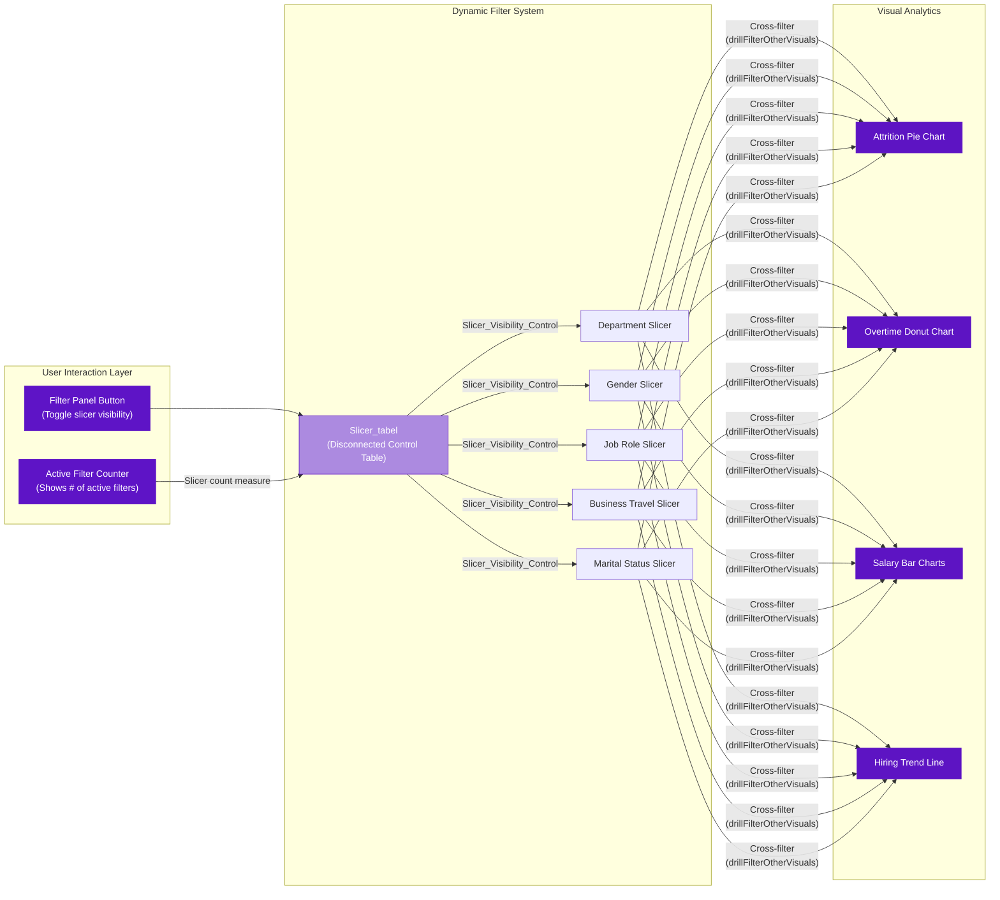
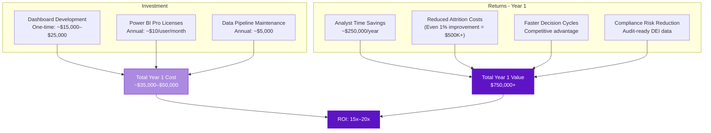

# Business Problem: Why Tesla HR Needs Interactive Analytics

## Executive Summary

Tesla's rapid global expansion—spanning automotive manufacturing, energy solutions, and AI research—creates a uniquely complex workforce management challenge. With thousands of employees across diverse departments, roles, and geographies, HR leadership requires real-time, interactive analytics to make data-driven decisions about attrition, compensation, overtime utilization, and hiring velocity. The **Tesla Employee Insights** dashboard replaces static, point-in-time reports with a dynamic, cross-filtered analytical environment that empowers every level of HR decision-making.

---

## The Challenge

Tesla's HR organization faces a convergence of workforce analytics challenges that static reporting simply cannot address:

### 1. Attrition Visibility Gap

Employee attrition at Tesla carries outsized cost implications. Replacing a single engineer in automotive R&D or battery technology can cost **150–250% of their annual salary** when accounting for recruitment, onboarding, lost institutional knowledge, and productivity ramp-up. Without interactive breakdowns of attrition by department, job role, salary range, and overtime status, HR leaders are left diagnosing turnover *after* it becomes a trend rather than *as* early signals emerge.

### 2. Overtime & Burnout Blind Spots

Tesla's fast-paced culture means overtime is structurally embedded in many roles. However, the relationship between overtime patterns and attrition is non-obvious—it varies by department, job role, marital status, and business travel frequency. Static reports show aggregate overtime percentages but cannot reveal the *intersection* of overtime with other workforce dimensions that predict burnout and voluntary departure.

### 3. Compensation Competitiveness Uncertainty

With salary data spanning multiple ranges (from entry-level to the **70k+** bracket), understanding how compensation distributes across the workforce—and how that distribution correlates with attrition and overtime—requires the ability to slice data dynamically. A fixed salary histogram tells you *what* the distribution looks like; an interactive one tells you *why* certain salary bands experience higher turnover.

### 4. Hiring Velocity Disconnect

Monthly hiring trends reveal seasonality, growth spurts, and hiring freezes. But without the ability to filter these trends by department, gender, or business travel requirements, workforce planning teams cannot align hiring pipelines with specific organizational needs.

### 5. Multi-Dimensional Analysis Paralysis

The core problem is **dimensionality**. Tesla's employee data spans at least **7 filterable dimensions**:

| Dimension | Example Values | Analytical Relevance |
|---|---|---|
| **Department** | Engineering, Sales, HR, Manufacturing | Cost center analysis, departmental attrition |
| **Gender** | Male, Female, Non-Binary | DEI reporting, pay equity audits |
| **Job Role** | Research Scientist, Sales Executive, Manager | Role-specific retention strategies |
| **Business Travel** | Travel_Rarely, Travel_Frequently, Non-Travel | Travel burden & burnout correlation |
| **Marital Status** | Single, Married, Divorced | Work-life balance policy design |
| **State** | California, Texas, Nevada, etc. | Geographic compensation benchmarking |
| **Salary Range** | <20k, 20–40k, 40–70k, 70k+ | Compensation band analysis |

Analyzing even **two dimensions simultaneously** generates dozens of unique segments. Three dimensions produce hundreds. Static reports cannot serve this combinatorial complexity—HR analysts spend more time *building* reports than *reading* them.

---

## Why Static Reports Fall Short

Traditional HR reporting at enterprises like Tesla typically follows a monthly or quarterly cadence: an analyst pulls data, builds charts in Excel or a static PDF, and distributes it to stakeholders. This model fails in several critical ways:

```mermaid
graph TD
    A["Static Report Created<br/>(Point-in-time snapshot)"] --> B["Distributed to Stakeholders"]
    B --> C["Stakeholder Has Follow-up Question"]
    C --> D["Request Sent Back to Analyst"]
    D --> E["Analyst Rebuilds Report<br/>(Hours to Days)"]
    E --> F["New Static Report Created"]
    F --> C
    
    style A fill:#AC8AE0,stroke:#5E14C6,color:#fff
    style C fill:#ff6b6b,stroke:#c92a2a,color:#fff
    style D fill:#ff6b6b,stroke:#c92a2a,color:#fff
    style E fill:#ff6b6b,stroke:#c92a2a,color:#fff
```

### Failure Modes of Static Reporting

| Failure Mode | Impact on Tesla HR | Cost |
|---|---|---|
| **Latency** | By the time a quarterly attrition report is reviewed, 3 months of voluntary departures have already occurred | Lost intervention window |
| **Rigidity** | A report showing attrition by department cannot answer "What does attrition look like for *married females in Engineering who travel frequently*?" | Unanswered strategic questions |
| **Analyst Bottleneck** | Every new question requires an analyst to re-query, re-format, and re-distribute | 4–8 hours per ad-hoc request |
| **Context Loss** | A bar chart of salary distribution, disconnected from attrition data, cannot reveal compensation-driven turnover | Misallocated retention budgets |
| **Version Confusion** | Multiple versions of "the attrition report" circulate with different date ranges and filters | Contradictory decision-making |
| **No Cross-Filtering** | Clicking on "Engineering" in one chart doesn't automatically filter overtime, salary, and hiring data | Siloed insights |

### The Real Cost

A conservative estimate: if Tesla HR analysts spend **15 hours per week** building ad-hoc static reports (a typical figure for large enterprises), and their fully-loaded cost is **$75/hour**, that's **$58,500 per year per analyst** spent on report *construction* rather than report *interpretation*. With a team of 5 analysts, that's nearly **$300,000 annually** in report-building labor that interactive dashboards can largely eliminate.

---

## The Dynamic Filtering Solution

The **Tesla Employee Insights** dashboard addresses every failure mode of static reporting through a purpose-built dynamic filtering architecture:

### How It Works

### Key Differentiators

1. **Self-Service Exploration**: Any stakeholder can filter by Department, Gender, Job Role, Business Travel, or Marital Status without requesting a new report.

2. **Cross-Filter Propagation**: Selecting "Yes" in the Attrition pie chart automatically filters the overtime donut, salary bars, and hiring trend line—revealing correlations instantly.

3. **Active Filter Awareness**: The Active Filter Counter (powered by the `Slicer count` measure) always shows how many filters are applied, preventing the "filtered but forgot" problem that plagues interactive dashboards.

4. **Contextual Slicer Panel**: The dynamic slicer panel uses `Slicer_Visibility_Control` to show/hide filter options on demand, keeping the main dashboard uncluttered while providing deep filtering when needed.

5. **Synchronized State**: The `syncGroup "slicer"` ensures that filter selections persist and synchronize across all related visuals, maintaining analytical context as users explore different dimensions.

---

## Business Benefits

### Quantifiable Impact

| Benefit | Metric | Expected Improvement |
|---|---|---|
| **Reduced Report Build Time** | Hours spent building ad-hoc HR reports per week | **70–85% reduction** (from 15 hrs to 2–4 hrs) |
| **Faster Time-to-Insight** | Time from question to answer | **From days to seconds** |
| **Attrition Early Warning** | Mean time to detect emerging attrition trends | **From quarterly to real-time** |
| **Compensation Audit Speed** | Time to complete pay equity analysis across segments | **From 2 weeks to 1 day** |
| **Decision Meeting Prep** | Time HR Business Partners spend preparing for leadership reviews | **60% reduction** |
| **Filter-Driven Discovery** | Number of cross-dimensional insights discovered per month | **5–10x increase** |

### Strategic Benefits

- **Proactive Retention**: By cross-filtering attrition with overtime, salary range, and department, HR can identify at-risk populations *before* they resign. For example: "Married employees in Engineering who travel frequently and earn in the 40–70k range have 3x the attrition rate"—an insight that only emerges through multi-dimensional interactive analysis.

- **Evidence-Based Compensation Strategy**: The split salary bar chart (separating the 70k+ bracket for emphasis) combined with attrition filtering enables Compensation Analysts to see exactly which salary bands are losing talent and whether pay adjustments could improve retention.

- **DEI Accountability**: Gender-filtered views across attrition, overtime, salary, and hiring trends provide auditable, real-time DEI metrics that support Tesla's diversity commitments and regulatory compliance.

- **Hiring Pipeline Optimization**: The monthly hiring trend line, filtered by department and role, reveals whether hiring velocity aligns with growth targets and where recruitment bottlenecks exist.

- **Overtime Policy Calibration**: The overtime donut chart, cross-filtered with attrition, shows the *actual* cost of overtime culture—not just hours worked, but the downstream effect on employee retention.

---

## Target Users

### Primary Stakeholders

#### 1. Chief Human Resources Officer (CHRO)

| Attribute | Detail |
|---|---|
| **Primary Use** | Executive-level workforce health overview |
| **Key Visuals** | Attrition Pie Chart (overall rate), Hiring Trend Line (growth velocity) |
| **Typical Filters** | None (full-company view) or Department-level |
| **Frequency** | Weekly executive review, board preparation |
| **Value Delivered** | Single-glance workforce health assessment; ability to drill into any dimension during leadership meetings without waiting for analyst support |

#### 2. HR Business Partners (HRBPs)

| Attribute | Detail |
|---|---|
| **Primary Use** | Department-specific workforce analytics for business unit leaders |
| **Key Visuals** | All visuals, filtered by their assigned department |
| **Typical Filters** | Department (primary), then Job Role, Business Travel |
| **Frequency** | Daily to weekly |
| **Value Delivered** | Eliminates the "pull me a report" cycle; HRBPs can self-serve answers during 1:1s with department heads, showing real-time attrition, overtime, and salary data specific to that department |

#### 3. Compensation & Benefits Analysts

| Attribute | Detail |
|---|---|
| **Primary Use** | Salary distribution analysis, pay equity audits, compensation benchmarking |
| **Key Visuals** | Salary Distribution Bar Charts (both the gradient chart and the 70k+ isolate), Attrition Pie Chart |
| **Typical Filters** | Gender (pay equity), Department, Job Role |
| **Frequency** | During compensation review cycles (quarterly) and ad-hoc |
| **Value Delivered** | Instant salary distribution segmentation; ability to cross-reference compensation bands with attrition to quantify the retention cost of under-compensation |

#### 4. Talent Acquisition & Workforce Planning

| Attribute | Detail |
|---|---|
| **Primary Use** | Hiring trend analysis, requisition planning, pipeline alignment |
| **Key Visuals** | Monthly Employee Hiring Trend (Line Chart), Attrition Pie Chart |
| **Typical Filters** | Department, Job Role, State |
| **Frequency** | Weekly pipeline reviews, quarterly planning |
| **Value Delivered** | Correlating hiring trends with attrition reveals net workforce growth/decline by segment; identifies whether hiring is keeping pace with departures |

#### 5. Department Managers & Directors

| Attribute | Detail |
|---|---|
| **Primary Use** | Team health monitoring, overtime management, headcount awareness |
| **Key Visuals** | Overtime Donut Chart, Attrition Pie Chart, Salary Distribution |
| **Typical Filters** | Department (auto-filtered to their team), Job Role |
| **Frequency** | Monthly team reviews, ad-hoc |
| **Value Delivered** | Managers see *their* team's data without navigating spreadsheets; overtime-to-attrition cross-filtering reveals if their team's work patterns are sustainable |

---

## ROI of Interactive Analytics

### Cost-Benefit Analysis

### ROI Breakdown

| Category | Annual Value | Calculation Basis |
|---|---|---|
| **Analyst Productivity** | $250,000 | 5 analysts × 11 hrs/week saved × $75/hr × 50 weeks |
| **Attrition Cost Avoidance** | $500,000+ | 1% attrition reduction × avg replacement cost of $100K × 500+ addressable employees |
| **Meeting Efficiency** | $50,000 | 200 meetings/year × 30 min saved × avg attendee cost |
| **Compliance Audit Savings** | $75,000 | Reduced external audit preparation time; self-service DEI reporting |
| **Decision Quality** | Unquantifiable | Better data → better decisions → better outcomes |

### Payback Period

With a total first-year investment of approximately **$35,000–$50,000** (including development, licensing, and maintenance) against identified annual savings and value creation of **$875,000+**, the Tesla Employee Insights dashboard achieves a **payback period of less than 3 weeks**.

---

## Conclusion

The shift from static HR reporting to interactive, cross-filtered analytics is not an incremental improvement—it is a **structural transformation** in how Tesla's HR organization creates and consumes workforce intelligence. The Tesla Employee Insights dashboard, with its dynamic filtering architecture, cross-visual propagation, and active filter awareness, delivers the analytical agility that a workforce of Tesla's scale and complexity demands.

> **The question is not whether Tesla can afford to invest in interactive HR analytics. The question is whether Tesla can afford not to.**
