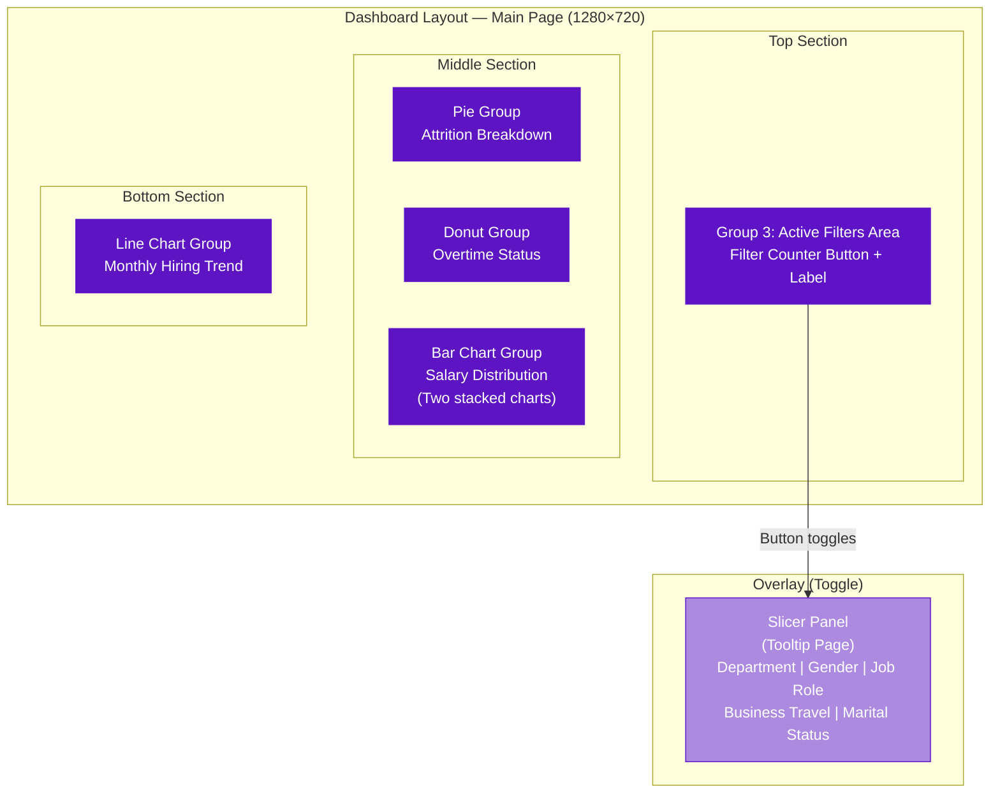
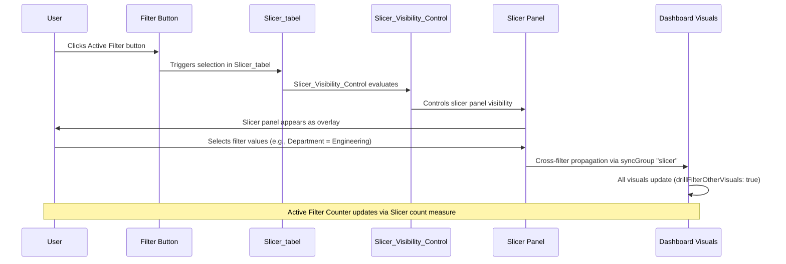
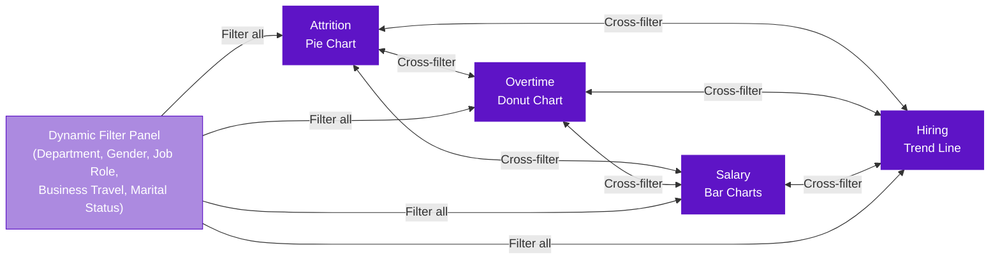

# Tesla Employee Insights — Dashboard Visual Guide

## Overview

The Tesla Employee Insights dashboard presents workforce analytics across a single main page (1280×720 resolution) with a toggleable slicer panel. The dashboard uses a cohesive **deep purple** color scheme (`#5E14C6` primary, `#AC8AE0` secondary, `#5D14C3` accent) with **Georgia** and **Courier New** typefaces to create a premium, executive-ready visual identity.

Every visual on the dashboard is configured with `drillFilterOtherVisuals: true`, meaning that clicking on any data point in one visual automatically cross-filters all other visuals on the page. This interconnected design transforms isolated charts into a unified analytical environment.

---

## Visual 1: Employee Attrition Breakdown (Pie Chart)

> **Visual Group**: `Pie`  
> **Chart Type**: Pie Chart  
> **Data**: `Attrition` (category) by `Count of EmployeeID` (values)  
> **Colors**: No = `#5E14C6` (deep purple) · Yes = `#AC8AE0` (light purple)  
> **Labels**: Percent of total  

### Purpose

This pie chart provides the most fundamental workforce health metric: **what proportion of employees have left the organization (attrition = "Yes") versus those who remain (attrition = "No")**. It serves as the dashboard's anchor visual—the first thing any stakeholder's eye is drawn to—because attrition rate is the single most important HR KPI for organizational stability.

The deliberate use of the **dominant deep purple** (`#5E14C6`) for "No" (retained employees) and the **lighter purple** (`#AC8AE0`) for "Yes" (departed employees) creates a visual hierarchy where retention is the primary color and attrition is visually secondary—reinforcing that retention is the norm and attrition is the deviation to investigate.

### Business Value

| Stakeholder | How They Use This Visual |
|---|---|
| **CHRO** | Instant read on overall attrition rate for board reporting; cross-filter by clicking "Yes" to see *who* is leaving across salary, overtime, and hiring dimensions |
| **HR Business Partners** | Filter by department first, then read attrition split to assess department health; compare across departments by toggling filters |
| **Compensation Analysts** | Click "Yes" segment to filter salary distribution charts—immediately reveals which salary bands have the highest attrition |
| **Department Managers** | Monitor whether their team's attrition rate exceeds company average; clicking "Yes" shows overtime distribution among departed employees |

### Insights Enabled

- **Overall Attrition Rate**: The percent-of-total labels show the exact attrition rate without mental math. If the "Yes" slice shows 16.1%, stakeholders know immediately that roughly 1 in 6 employees has left.

- **Cross-Filter Discovery**: Clicking the "Yes" (attrition) slice is the most powerful single interaction in the dashboard. It instantly transforms every other visual to show data *only for employees who left*, revealing:
  - Were they disproportionately working overtime? (Donut chart filters)
  - What salary range were they in? (Bar charts filter)
  - When were they hired? (Line chart filters—short-tenure attrition becomes visible)

- **Segment Comparison**: With the slicer panel active, users can compare attrition rates across any dimension. For example, filtering to "Engineering" and then to "Sales" reveals whether attrition is an organizational problem or a departmental one.

### Reading This Visual

- A **large deep purple slice** (No) with a **small light purple slice** (Yes) indicates healthy retention
- If the light purple slice grows beyond **15–20%**, it signals an attrition rate that warrants immediate investigation
- **Always check**: after applying any filter, glance at this pie chart to see if attrition shifts—this is the fastest way to find high-attrition segments

---

## Visual 2: Overtime Status Distribution (Donut Chart)

> **Visual Group**: `donut`  
> **Chart Type**: Donut Chart  
> **Data**: `OverTime` (category) by `Count of EmployeeID` (values)  
> **Colors**: Yes = `#5E14C6` (deep purple) · No = `#AC8AE0` (light purple)  
> **Labels**: Data labels in thousands  

### Purpose

This donut chart quantifies the **overtime culture** within the organization by showing how many employees work overtime versus those who do not. The hollow center of the donut distinguishes it visually from the attrition pie chart while maintaining the same color language.

Note the **inverted color assignment** compared to the attrition pie chart: here, "Yes" (overtime = true) uses the dominant `#5E14C6`, while "No" uses `#AC8AE0`. This is a deliberate design choice—overtime is the *active state* being measured, so it receives the primary color, unlike attrition where "No" (retention) is the desired state.

### Business Value

| Stakeholder | How They Use This Visual |
|---|---|
| **CHRO** | Understand the scale of overtime dependency; if >30% of the workforce is regularly working overtime, it signals a systemic capacity issue |
| **HR Business Partners** | Cross-reference with department filter to identify which departments over-rely on overtime |
| **Department Managers** | Assess whether their team's overtime rate is an outlier; clicking "Yes" shows if overtime workers are also in the highest attrition segment |
| **Talent Acquisition** | High overtime rates signal under-staffing—critical input for headcount planning and requisition prioritization |

### Insights Enabled

- **Overtime Prevalence**: The data labels (displayed in thousands) show the absolute count of employees in each category. Combined with the visual proportions, stakeholders can immediately assess overtime scale.

- **Overtime-Attrition Correlation**: This is one of the most critical cross-filter pathways in the dashboard:
  1. Click "Yes" on the overtime donut
  2. Observe the attrition pie chart—does the attrition rate increase among overtime workers?
  3. If the "Yes" attrition slice grows from 16% to 25% when filtering to overtime employees, that's a clear signal that overtime is a turnover driver

- **Department-Specific Overtime**: After filtering by department, this donut reveals which teams have sustainable vs. unsustainable work patterns. Manufacturing at 40% overtime tells a very different story than HR at 40% overtime.

- **Salary-Overtime Relationship**: Cross-filtering overtime "Yes" with the salary bar chart reveals whether overtime is concentrated in lower salary bands (suggesting under-compensation for hours worked) or higher bands (suggesting cultural/expectation issues).

### Reading This Visual

- The donut format emphasizes **proportionality over absolute numbers**
- Data labels in thousands give the raw count for context
- A healthy overtime rate is typically **20–28%** of the workforce; above this suggests structural issues
- Cross-filter with attrition *first*, then with salary and department for the deepest insights

---

## Visual 3: Salary Distribution Across Ranges (Clustered Bar Charts)

> **Visual Group**: `Bar chart`  
> **Chart Type**: Two Clustered Bar Charts (stacked vertically)  
> **Data**: `Salary Range` (axis) by `Count of EmployeeID` (values)  
> **Colors**: Gradient fill from `#AC8AE0` (light purple) → `#5C15C4` (deep purple)  
> **Filters**: Chart 1 excludes `70k+` · Chart 2 shows *only* `70k+`  

### Purpose

This is actually **two coordinated bar charts** that together present the complete salary distribution across the workforce, with a deliberate architectural split:

1. **Lower Chart**: Shows all salary ranges *except* 70k+ (i.e., <20k, 20–40k, 40–70k), using a gradient fill that transitions from lighter purple at lower salary bands to deeper purple at higher bands. This gradient reinforces the "ascending value" perception.

2. **Upper Chart**: Isolates the **70k+ salary range** as a standalone bar. This separation serves a critical analytical purpose: the 70k+ bracket likely contains a disproportionately large or small number of employees compared to other ranges, and displaying it alongside tightly-banded lower ranges would distort the visual scale.

The gradient fill (`#AC8AE0` → `#5C15C4`) is not merely decorative—it creates an intuitive "heat map" effect where deeper purple signals higher compensation, establishing a visual metaphor that stakeholders can read instinctively.

### Business Value

| Stakeholder | How They Use This Visual |
|---|---|
| **Compensation Analysts** | Primary visual for salary band analysis; filter by gender for pay equity audits, by department for compensation benchmarking |
| **CHRO** | Overview of compensation distribution; the 70k+ isolate shows executive/senior staff density |
| **HR Business Partners** | Compare salary distributions across departments to identify compensation misalignment |
| **Talent Acquisition** | Understand where offers typically land; identify if certain salary bands are under-populated (hiring gaps) or over-populated (budget risk) |

### Insights Enabled

- **Distribution Shape Analysis**: A healthy salary distribution for a growth-stage company like Tesla should show a moderate concentration in mid-ranges (20–40k, 40–70k) with meaningful populations in both the entry-level (<20k) and senior (70k+) brackets. Extreme skew in either direction signals structural issues.

- **Attrition by Compensation**: Cross-filtering with the attrition pie chart ("Yes" selected) transforms the salary bars to show *only departed employees*. If the <20k and 20–40k bars dominate the attrition-filtered view while 70k+ virtually disappears, the data proves that under-compensation is driving turnover.

- **The 70k+ Signal**: The isolated 70k+ bar deserves special attention:
  - If it's very small relative to other bands → potential senior talent attraction problem
  - If it's growing over time (cross-reference with hiring trend) → healthy career progression pipeline
  - If it shows high attrition → critical retention risk for your most expensive-to-replace employees

- **Gender Pay Equity**: Filtering by gender and comparing salary distributions is one of the most compliance-critical analyses this dashboard enables. If the female-filtered distribution skews lower than the male-filtered one within the same department and job role, it surfaces potential pay equity issues.

- **Department Compensation Profiles**: Filtering by department reveals fundamentally different salary distribution shapes—Engineering may concentrate in 40–70k and 70k+, while a support function may concentrate in <20k and 20–40k. These differences are expected but must be monitored.

### Reading This Visual

- Read the **lower chart** (gradient bars) for the bulk distribution across salary bands
- Read the **upper chart** (70k+ isolate) for senior compensation density
- The **gradient** creates visual momentum—your eye naturally follows from lighter (lower salary) to darker (higher salary)
- When cross-filtering, watch for **bars that shrink disproportionately**—these are the salary bands that are *not* affected by the filter, meaning the filtered segment (e.g., attrition) is concentrated elsewhere

---

## Visual 4: Monthly Employee Hiring Trend (Line Chart)

> **Visual Group**: `linechart`  
> **Chart Type**: Line Chart (smooth line with markers)  
> **Data**: `HireDate` Month hierarchy (axis) by `Count of EmployeeID` (values)  
> **Style**: Smooth (curved) interpolation, individual data point markers  

### Purpose

This line chart tracks **hiring volume over time** using the month hierarchy derived from each employee's `HireDate`. The smooth line interpolation (as opposed to straight-line segments) creates a visually polished trend that emphasizes the *flow* of hiring rather than discrete monthly jumps. Data point markers at each month ensure that individual values remain readable.

The HireDate Month hierarchy enables drill-down from year-level trends to month-level granularity, allowing both strategic (annual hiring trajectory) and tactical (monthly hiring spikes/dips) analysis.

### Business Value

| Stakeholder | How They Use This Visual |
|---|---|
| **Talent Acquisition** | Primary planning visual; identifies seasonal hiring patterns, compares current year hiring velocity to prior years |
| **CHRO** | Strategic view of organizational growth; presents hiring trajectory to board alongside attrition data for net headcount analysis |
| **Workforce Planning** | Aligns hiring trends with business milestones (product launches, factory openings, expansion into new markets) |
| **Department Managers** | Filter by department to see their team's hiring timeline; useful for onboarding capacity planning |

### Insights Enabled

- **Seasonality Detection**: Most large organizations have predictable hiring seasonality—spikes in Q1 (new budget year), Q3 (post-summer ramp), or aligned with university graduation cycles. The smooth line makes seasonal patterns visually obvious.

- **Growth Trajectory**: The overall slope of the trend line reveals whether Tesla is in a hiring expansion, steady state, or contraction phase. Steep upward slopes signal rapid growth; flattening or downward curves signal hiring freezes or organizational restructuring.

- **Net Headcount Analysis**: When the attrition pie chart's "Yes" segment is selected, this line chart transforms to show the *hiring timeline of departed employees*. This reveals:
  - **Short-tenure attrition**: If the filtered line is concentrated in recent months, new hires are leaving quickly (onboarding/fit problem)
  - **Long-tenure attrition**: If the filtered line is concentrated in older months, experienced employees are leaving (engagement/compensation problem)
  - **Uniform distribution**: Attrition is evenly spread across tenure, suggesting a systemic rather than cohort-specific issue

- **Department-Filtered Hiring**: Filtering by department shows each team's hiring timeline independently, revealing which departments are growing, stable, or shrinking.

- **Post-Filter Anomalies**: Dramatic shape changes in the hiring trend when filters are applied reveal important stories. For example, if filtering to "Travel_Frequently" shows a hiring spike 6 months ago followed by an attrition spike in the same group, it suggests that frequent travel is causing early-stage turnover.

### Reading This Visual

- The **smooth line** emphasizes trends over individual data points—look for slopes and curves, not individual months
- **Markers** on each data point let you hover for precise monthly counts
- The Month hierarchy enables **drill-down**: start at the year level for strategic view, drill into months for tactical analysis
- Cross-filter from the attrition pie chart to transform this from a "hiring trend" into a "when-did-departed-employees-join" analysis—one of the most powerful cross-filter combinations in the dashboard

---

## Visual 5: Dynamic Filter Panel (Slicer Panel)

> **Page Type**: Tooltip page (overlay)  
> **Controlled By**: `Slicer_tabel` disconnected table  
> **Key Measures**: `Slicer_Visibility_Control`, `Slicer_Image`, `Slicer_Font_Color`, `Selected Slicer`, `Label_for_slicers`  
> **Sync Group**: `slicer`  
> **Available Filters**: Department, Gender, Job Role, Business Travel, Marital Status  

### Purpose

The Dynamic Filter Panel is not a traditional Power BI slicer panel—it is an **architecturally sophisticated filtering system** built on a disconnected control table (`Slicer_tabel`) that manages slicer visibility, iconography, and styling through DAX measures. The panel overlays the main dashboard as a tooltip-type page, triggered by the Active Filter button, and provides access to all five filterable dimensions.

This design solves a core UX problem in Power BI dashboards: **slicers consume valuable screen real estate**. By hiding them behind a toggleable panel with dynamic visibility control, the main page dedicates its full 1280×720 canvas to analytical visuals while offering deep filtering capabilities on demand.

### How It Works

### Business Value

| Capability | Value |
|---|---|
| **On-Demand Filtering** | Users see only the charts by default; filters appear when needed and disappear when done |
| **Visual Consistency** | The panel uses `Slicer_Image` for dynamic icons and `Slicer_Font_Color` for conditional text styling, creating a polished, app-like experience |
| **Persistent State** | The `syncGroup "slicer"` ensures filter selections persist even when the panel is hidden—users don't lose their filter context |
| **Self-Documenting** | `Label_for_slicers` provides contextual labels, and the Active Filter Counter shows how many filters are active, preventing the "hidden filter" problem |

### Available Filter Dimensions

| Slicer | Source Column | Example Values | Analytical Use |
|---|---|---|---|
| **Department** | `Employee[Department]` | Engineering, Sales, HR, Manufacturing | Department-level workforce analysis |
| **Gender** | `Employee[Gender]` | Male, Female | DEI reporting, pay equity |
| **Job Role** | `Employee[JobRole]` | Research Scientist, Sales Executive, Manager, Lab Technician | Role-specific retention and compensation analysis |
| **Business Travel** | `Employee[BusinessTravel]` | Travel_Rarely, Travel_Frequently, Non-Travel | Travel burden correlation with attrition and overtime |
| **Marital Status** | `Employee[MaritalStatus]` | Single, Married, Divorced | Work-life balance policy design |

### Insights Enabled

The panel itself doesn't generate insights—it *enables* them. The five slicers create a combinatorial space of hundreds of workforce segments. Some of the most valuable filter combinations include:

| Filter Combination | Insight Revealed |
|---|---|
| Department = Engineering + Gender = Female | Gender representation and pay equity in engineering |
| Business Travel = Travel_Frequently + Overtime = Yes (cross-filter) | Double-burden employees at highest burnout risk |
| Marital Status = Single + Salary Range = <20k (cross-filter) | Young, under-compensated employees—highest flight risk |
| Job Role = Manager + Attrition = Yes (cross-filter) | Manager attrition—critical for organizational stability |
| Department = Sales + Overtime = Yes (cross-filter) + Attrition = Yes | Whether overtime in sales is actually driving turnover |

---

## Visual 6: Active Filter Counter (Action Button)

> **Visual Group**: `Group 3` (Active Filters area)  
> **Components**: Action Button + Shape (label text: "Active Filters")  
> **Button Display**: `Slicer count` measure (numeric value)  
> **Font Color**: `button text color` measure (dynamic)  

### Purpose

The Active Filter Counter is a small but critically important UX element. It consists of two components:

1. **Shape/Label**: A static text element displaying "Active Filters" as a label
2. **Action Button**: Displays the current value of the `Slicer count` measure—a number indicating how many slicer filters are currently applied

The button's font color is controlled by the `button text color` measure, which dynamically changes the text styling based on state (e.g., different color when filters are active vs. when no filters are applied). This visual feedback ensures users always know their current filter context.

### Business Value

This element prevents the most dangerous failure mode in interactive dashboards: **the invisible filter**. Without a filter counter:

- A manager could look at the dashboard and see 50 employees with 30% attrition, not realizing they're viewing a filtered subset (e.g., only the Sales department)
- An executive could present numbers in a board meeting that are actually filtered to a single job role
- An analyst could draw conclusions from data that has 3 hidden filters applied from a previous session

The Active Filter Counter makes the dashboard's filter state **explicit and always visible**, functioning as a "status bar" for the analytical context.

### How It Works

| Component | DAX Measure | Behavior |
|---|---|---|
| **Counter Number** | `Slicer count` | Counts the number of slicers that have non-default (filtered) selections. Displays as a number on the button face (e.g., "0", "1", "3") |
| **Text Color** | `button text color` | Evaluates the current filter state and returns a color code. Likely returns one color when count = 0 (no filters) and another when count > 0 (filters active) |
| **Label** | Static shape | Displays "Active Filters" text above/beside the counter button |

### Insights Enabled

- **Filter Awareness**: At a glance, users know exactly how many filters are active. A counter showing "3" tells the user that the current view is heavily filtered and may not represent the full workforce.

- **Reset Trigger**: When the counter shows a non-zero value, it signals users to consider whether they want to clear filters before starting a new analysis.

- **Presentation Safety**: Before presenting dashboard findings, stakeholders can verify the counter shows "0" (full dataset) or confirm the correct number of intentional filters.

- **Dynamic Styling**: The `button text color` measure provides visual emphasis—when filters are active, the counter likely changes to a high-contrast color (or the inverse), creating an immediate visual signal that the dashboard is in a filtered state.

### Reading This Visual

- **Counter = 0**: You're viewing the full, unfiltered dataset. All visuals show company-wide data.
- **Counter = 1–2**: Moderate filtering. Common for focused analysis (e.g., one department or one gender).
- **Counter = 3+**: Heavy filtering. The data represents a narrow segment. Verify this is intentional before drawing conclusions.
- **Button color changes**: The dynamic font color serves as a secondary indicator—even without reading the number, the color shift signals that the filter state has changed.

---

## Cross-Filter Interaction Map

All visuals in the Tesla Employee Insights dashboard have `drillFilterOtherVisuals: true`, creating a fully interconnected analytical environment. The following table documents the most impactful cross-filter pathways:

| Source Visual | Selection | Effect on Other Visuals |
|---|---|---|
| **Attrition Pie** → "Yes" | Click the light purple slice | Overtime donut shows overtime distribution *among departed employees*; Salary bars show salary distribution of departed; Hiring trend shows *when departed employees were hired* |
| **Attrition Pie** → "No" | Click the deep purple slice | All visuals filter to retained employees only—useful for understanding the *healthy* workforce profile |
| **Overtime Donut** → "Yes" | Click the deep purple slice | Attrition pie shows attrition rate *among overtime workers*; Salary bars show overtime workers' compensation; Hiring trend shows when overtime workers were hired |
| **Salary Bars** → Any range | Click a specific salary band | Attrition pie shows attrition rate for that salary band; Overtime donut shows overtime prevalence at that pay level; Hiring trend shows when employees in that band were hired |
| **Hiring Trend** → Any month/period | Click a data point | All visuals filter to employees hired in that period—enables cohort analysis (e.g., "How are employees hired in January performing?") |

---

## Recommended Analysis Workflows

### Workflow 1: Attrition Root Cause Analysis

1. Start with the **Attrition Pie Chart** — note the overall attrition rate
2. Click **"Yes"** (departed employees)
3. Read the **Overtime Donut** — is overtime disproportionately high among departed employees?
4. Read the **Salary Bars** — which salary ranges lost the most employees?
5. Read the **Hiring Trend** — were departed employees mostly recent hires (onboarding issue) or tenured staff (engagement issue)?
6. Open the **Filter Panel** → select a specific Department → repeat steps 2–5 for department-level analysis

### Workflow 2: Pay Equity Audit

1. Open the **Filter Panel** → select Gender = Female
2. Read the **Salary Bar Charts** — note the distribution shape
3. Clear the gender filter → select Gender = Male
4. Compare the salary distribution shape to the female-filtered view
5. For deeper analysis, add a Department filter to compare within the same department
6. Check the **Attrition Pie** for each gender — is attrition higher for the lower-paid gender?

### Workflow 3: Department Health Check

1. Open the **Filter Panel** → select a specific Department
2. Read all four analytical visuals as a "scorecard" for that department:
   - Attrition rate (Pie)
   - Overtime rate (Donut)
   - Salary distribution (Bars)
   - Hiring momentum (Line)
3. Toggle to the next department and compare
4. Identify departments that are outliers on any metric

### Workflow 4: Overtime Impact Assessment

1. Click **"Yes"** on the **Overtime Donut**
2. Read the **Attrition Pie** — what's the attrition rate for overtime workers?
3. Read the **Salary Bars** — are overtime workers concentrated in lower salary bands?
4. Open the **Filter Panel** → filter by Business Travel = Travel_Frequently
5. Observe if overtime + frequent travel compounds the attrition effect
6. Use these findings to justify overtime policy changes or compensation adjustments
