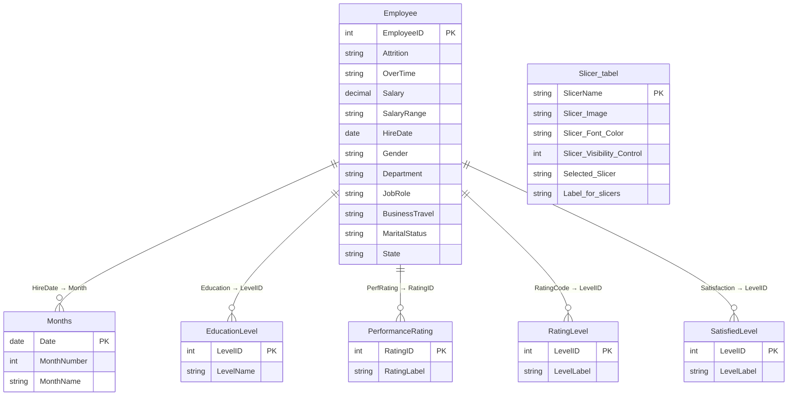
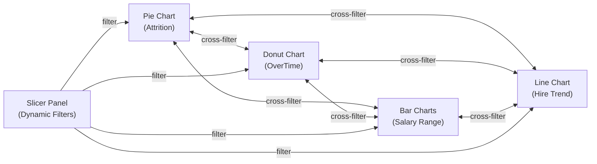

# 📖 Data Dictionary — Tesla Employee Insights Dashboard

> **Dashboard**: Tesla Employee Insights  
> **Power BI Version**: Desktop (PBIX)  
> **Last Updated**: June 2026  
> **Canvas**: 1280 × 720 px

---

## Table of Contents

- [Data Model Overview](#data-model-overview)
- [Relationship Diagram](#relationship-diagram)
- [Table 1 — Employee (Fact Table)](#table-1--employee-fact-table)
- [Table 2 — Months (Date/Calendar Dimension)](#table-2--months-datecalendar-dimension)
- [Table 3 — Slicer\_tabel (Disconnected Control Table)](#table-3--slicer_tabel-disconnected-control-table)
- [Table 4 — slicer img (Image Asset Table)](#table-4--slicer-img-image-asset-table)
- [Table 5 — selection (UI State Table)](#table-5--selection-ui-state-table)
- [Table 6 — EducationLevel (Dimension Lookup)](#table-6--educationlevel-dimension-lookup)
- [Table 7 — PerformanceRating (Dimension Lookup)](#table-7--performancerating-dimension-lookup)
- [Table 8 — RatingLevel (Dimension Lookup)](#table-8--ratinglevel-dimension-lookup)
- [Table 9 — SatisfiedLevel (Dimension Lookup)](#table-9--satisfiedlevel-dimension-lookup)
- [Calculated Measures Catalog](#calculated-measures-catalog)
- [Data Type Reference](#data-type-reference)
- [Column Lineage & Cross-References](#column-lineage--cross-references)

---

## Data Model Overview

The Tesla Employee Insights dashboard uses a **hybrid star-schema** data model composed of:

| Category | Tables | Purpose |
|---|---|---|
| **Fact Table** | `Employee` | Core HR data — one row per employee |
| **Date Dimension** | `Months` | Calendar hierarchy for hiring trend analysis |
| **Lookup Dimensions** | `EducationLevel`, `PerformanceRating`, `RatingLevel`, `SatisfiedLevel` | Decode numeric ratings into descriptive labels |
| **Disconnected Tables** | `Slicer_tabel`, `slicer img`, `selection` | Dynamic UI control — slicer visibility, images, and selection state |

> [!IMPORTANT]
> The disconnected tables (`Slicer_tabel`, `slicer img`, `selection`) have **no relationships** to the fact table. They drive the dynamic filter panel UX through DAX measures, not through model relationships.

---

## Relationship Diagram

---

## Table 1 — Employee (Fact Table)

> **Role**: Primary fact table containing one row per Tesla employee.  
> **Row Grain**: One record = one unique employee.  
> **Used By**: All visuals on the main page (Pie Chart, Donut Chart, Bar Charts, Line Chart).

| # | Column Name | Data Type | Nullable | Example Values | Description | Business Purpose |
|---|---|---|---|---|---|---|
| 1 | `EmployeeID` | Integer (Whole Number) | No | `1001`, `1002`, `2450` | Unique identifier for each employee. Primary key of the table. | Serves as the grain identifier; used in `COUNT(EmployeeID)` aggregations across all visuals. |
| 2 | `Attrition` | Text (String) | No | `"Yes"`, `"No"` | Indicates whether the employee has left the organization. | Drives the **Pie Chart — Employee Attrition Breakdown**. `"No"` = #5E14C6 (purple), `"Yes"` = #AC8AE0 (light purple). Key HR metric for retention analysis. |
| 3 | `OverTime` | Text (String) | No | `"Yes"`, `"No"` | Indicates whether the employee works overtime. | Drives the **Donut Chart — Overtime Status Distribution**. `"Yes"` = #5E14C6, `"No"` = #AC8AE0. Used to correlate overtime with attrition. |
| 4 | `Salary` | Decimal Number | No | `45000.00`, `72000.00`, `120000.00` | Annual salary in USD. | Underlying numeric value for salary analysis. Not directly visualized but supports the `Salary Range` bucketing. |
| 5 | `Salary Range` | Text (String) | No | `"10k-20k"`, `"20k-30k"`, `"30k-40k"`, `"40k-50k"`, `"50k-60k"`, `"60k-70k"`, `"70k+"` | Pre-bucketed salary range category. | Drives both **Clustered Bar Charts**. The main bar chart applies a filter to **exclude** `"70k+"`, which is rendered in a separate top bar chart. Gradient fill from #AC8AE0 → #5C15C4. |
| 6 | `HireDate` | Date | No | `2020-03-15`, `2022-11-01` | The date the employee was hired. | Drives the **Line Chart — Monthly Employee Hiring Trend** using a Month hierarchy. Enables time-series analysis of recruitment patterns. |
| 7 | `Gender` | Text (String) | No | `"Male"`, `"Female"`, `"Non-Binary"` *(inferred)* | Gender identity of the employee. | Available as a **slicer filter** on the dynamic slicer panel. Cross-filters all visuals when selected. |
| 8 | `Department` | Text (String) | No | `"Engineering"`, `"Sales"`, `"Human Resources"`, `"Research & Development"` *(inferred typical values)* | The organizational department the employee belongs to. | Available as a **slicer filter**. Critical for departmental attrition and salary analysis. |
| 9 | `JobRole` | Text (String) | No | `"Software Engineer"`, `"Sales Executive"`, `"Research Scientist"`, `"Manager"` *(inferred typical values)* | The specific job title/role of the employee. | Available as a **slicer filter**. Enables role-level drill-down on salary and attrition. |
| 10 | `BusinessTravel` | Text (String) | No | `"Travel_Rarely"`, `"Travel_Frequently"`, `"Non-Travel"` | Frequency of business travel required by the role. | Available as a **slicer filter**. Useful for analyzing travel impact on attrition and overtime. |
| 11 | `MaritalStatus` | Text (String) | No | `"Single"`, `"Married"`, `"Divorced"` | Marital status of the employee. | Available as a **slicer filter**. Supports demographic analysis of workforce composition. |
| 12 | `State` | Text (String) | No | `"California"`, `"Texas"`, `"Nevada"` *(inferred typical values)* | US state where the employee is based. | Available as a **slicer filter**. Enables geographic segmentation of workforce data. Potential future use for Row-Level Security. |

> [!NOTE]
> Columns marked *(inferred typical values)* have example values derived from common HR analytics datasets. Actual values in the PBIX may differ.

---

## Table 2 — Months (Date/Calendar Dimension)

> **Role**: Date dimension table supporting the hiring trend line chart.  
> **Relationship**: Linked to `Employee.HireDate` via a date key.  
> **Contains Measures**: `Slicer count`, `button text color`.

| # | Column Name | Data Type | Nullable | Example Values | Description | Business Purpose |
|---|---|---|---|---|---|---|
| 1 | `Date` *(inferred)* | Date | No | `2020-01-01`, `2023-06-01` | Calendar date, likely at month granularity. | Provides the X-axis for the Line Chart — Monthly Employee Hiring Trend. |
| 2 | `MonthNumber` *(inferred)* | Integer | No | `1`, `6`, `12` | Numeric month (1–12). | Supports month-level sorting in the line chart hierarchy. |
| 3 | `MonthName` *(inferred)* | Text | No | `"January"`, `"June"`, `"December"` | Display name for each month. | Provides readable labels on the line chart X-axis. |

### Measures Hosted in Months Table

| Measure Name | Return Type | Description | Used In |
|---|---|---|---|
| `Slicer count` | Integer | Counts the number of currently active slicer filters across all slicer controls. | **Action Button** — displays the count of active filters. |
| `button text color` | Text (Color Hex) | Returns a dynamic font color for the action button based on whether filters are active. | **Action Button** — conditional formatting of font color. |

> [!TIP]
> The `Slicer count` measure likely uses a pattern like `COUNTROWS(FILTER(Slicer_tabel, [Slicer_Visibility_Control] = 1))` or iterates over slicer selections to tally active filters.

---

## Table 3 — Slicer_tabel (Disconnected Control Table)

> **Role**: Disconnected table (no model relationships) that powers the **dynamic slicer panel** system.  
> **Relationship**: None — communicates with visuals purely through DAX measures.  
> **syncGroup**: `"slicer"` — ensures slicer selections synchronize across pages.

| # | Column/Measure Name | Data Type | Nullable | Example Values | Description | Business Purpose |
|---|---|---|---|---|---|---|
| 1 | `Slicer_Image` | Text (Image URL/Path) | No | `"data:image/svg+xml;..."`, `"/icons/department.svg"` *(inferred)* | Returns an image reference (SVG/URL) for the slicer icon. | Provides visual icons next to each slicer option in the slicer panel for a polished UX. |
| 2 | `Slicer_Font_Color` | Text (Color Hex) | No | `"#5E14C6"`, `"#AC8AE0"`, `"#FFFFFF"` *(inferred)* | Returns a hex color code for the slicer label font. | Dynamically colors slicer labels — e.g., highlighting selected slicers in the accent purple (#5D14C3). |
| 3 | `Slicer_Visibility_Control` | Integer or Boolean | No | `1`, `0` or `TRUE`, `FALSE` | Controls whether a specific slicer is visible or hidden on the canvas. | Core of the **show/hide slicer panel** mechanism. When the action button is clicked, this measure toggles visibility. |
| 4 | `Selected Slicer` | Text | No | `"Department"`, `"Gender"`, `"JobRole"` *(inferred)* | Identifies which slicer category is currently selected/active. | Drives the conditional logic in `Slicer_Visibility_Control` — only the selected slicer type is shown. |
| 5 | `Label_for_slicers` | Text | No | `"Department"`, `"Gender"`, `"Job Role"`, `"Travel"`, `"Marital Status"` *(inferred)* | Human-readable display label for each slicer category. | Provides the text labels rendered on the slicer panel tooltip page. |

> [!IMPORTANT]
> This table is the **heart of the dynamic filtering architecture**. It uses a SWITCH/SELECTEDVALUE pattern where selecting a row in this table triggers DAX measures that show/hide the corresponding Employee table slicer.

---

## Table 4 — slicer img (Image Asset Table)

> **Role**: Stores image references (icons, SVGs) for the slicer panel UI elements.  
> **Relationship**: Likely referenced by `Slicer_tabel.Slicer_Image` measure.

| # | Column Name | Data Type | Nullable | Example Values | Description | Business Purpose |
|---|---|---|---|---|---|---|
| 1 | `ImageName` *(inferred)* | Text | No | `"department_icon"`, `"gender_icon"` | Identifier for the image asset. | Maps slicer categories to their corresponding visual icons. |
| 2 | `ImageURL` *(inferred)* | Text (Image URL) | No | `"data:image/svg+xml;base64,..."` | Base64-encoded SVG or URL to image file. | Rendered as the icon in the slicer panel for each filter category. |

> [!NOTE]
> This table's exact schema is inferred from its name and role in the slicer panel system. It likely contains base64-encoded SVG images for a self-contained, portable design.

---

## Table 5 — selection (UI State Table)

> **Role**: Tracks user selection state for the dynamic filter panel.  
> **Relationship**: Disconnected — works through DAX measures.

| # | Column Name | Data Type | Nullable | Example Values | Description | Business Purpose |
|---|---|---|---|---|---|---|
| 1 | `SelectionID` *(inferred)* | Integer | No | `1`, `2`, `3` | Unique identifier for each selectable option. | Provides a key for the selection state tracking. |
| 2 | `SelectionValue` *(inferred)* | Text | No | `"Department"`, `"Gender"` | The value or category that can be selected. | Determines which slicer panel view to display based on user interaction. |

> [!NOTE]
> This table works in tandem with `Slicer_tabel` to manage which slicer is currently active in the dynamic filter panel.

---

## Table 6 — EducationLevel (Dimension Lookup)

> **Role**: Lookup/dimension table that maps numeric education codes to descriptive labels.  
> **Relationship**: Linked to `Employee` table via an education column.

| # | Column Name | Data Type | Nullable | Example Values | Description | Business Purpose |
|---|---|---|---|---|---|---|
| 1 | `LevelID` *(inferred)* | Integer | No | `1`, `2`, `3`, `4`, `5` | Numeric education level code. | Foreign key linking to the Employee table's education column. |
| 2 | `LevelName` *(inferred)* | Text | No | `"Below College"`, `"College"`, `"Bachelor"`, `"Master"`, `"Doctor"` | Human-readable education level label. | Provides display-friendly education categories for filtering and potential future visuals. |

---

## Table 7 — PerformanceRating (Dimension Lookup)

> **Role**: Lookup table mapping numeric performance rating codes to descriptive categories.  
> **Relationship**: Linked to `Employee` table via a performance rating column.

| # | Column Name | Data Type | Nullable | Example Values | Description | Business Purpose |
|---|---|---|---|---|---|---|
| 1 | `RatingID` *(inferred)* | Integer | No | `1`, `2`, `3`, `4` | Numeric performance rating code. | Foreign key linking to the Employee table's performance rating column. |
| 2 | `RatingLabel` *(inferred)* | Text | No | `"Low"`, `"Good"`, `"Excellent"`, `"Outstanding"` | Descriptive performance category. | Decodes numeric ratings into business-meaningful labels for HR analysis. |

---

## Table 8 — RatingLevel (Dimension Lookup)

> **Role**: General-purpose rating level lookup, potentially for job satisfaction or environment satisfaction.  
> **Relationship**: Linked to `Employee` table via a rating column.

| # | Column Name | Data Type | Nullable | Example Values | Description | Business Purpose |
|---|---|---|---|---|---|---|
| 1 | `LevelID` *(inferred)* | Integer | No | `1`, `2`, `3`, `4` | Numeric rating level. | Foreign key for rating-based segmentation. |
| 2 | `LevelLabel` *(inferred)* | Text | No | `"Low"`, `"Medium"`, `"High"`, `"Very High"` | Descriptive rating label. | Enables rating-based filtering and display in potential future visuals. |

---

## Table 9 — SatisfiedLevel (Dimension Lookup)

> **Role**: Satisfaction level lookup for employee satisfaction metrics.  
> **Relationship**: Linked to `Employee` table via a satisfaction column.

| # | Column Name | Data Type | Nullable | Example Values | Description | Business Purpose |
|---|---|---|---|---|---|---|
| 1 | `LevelID` *(inferred)* | Integer | No | `1`, `2`, `3`, `4` | Numeric satisfaction level. | Foreign key for satisfaction-based segmentation. |
| 2 | `LevelLabel` *(inferred)* | Text | No | `"Low"`, `"Medium"`, `"High"`, `"Very High"` | Descriptive satisfaction label. | Supports employee satisfaction analysis and potential correlation with attrition. |

---

## Calculated Measures Catalog

The following DAX measures drive the dashboard's dynamic behavior:

| Measure Name | Host Table | Return Type | Purpose | Visual Dependencies |
|---|---|---|---|---|
| `Slicer_Image` | `Slicer_tabel` | Text (Image URL) | Returns the icon image for the currently selected slicer category | Slicer panel tooltip page |
| `Slicer_Font_Color` | `Slicer_tabel` | Text (Color Hex) | Returns dynamic font color for slicer labels based on selection state | Slicer panel tooltip page |
| `Slicer_Visibility_Control` | `Slicer_tabel` | Integer (0/1) | Controls show/hide state of individual slicers via the syncGroup `"slicer"` | All hidden slicers on main page |
| `Selected Slicer` | `Slicer_tabel` | Text | Identifies the currently active slicer category | Conditional logic in other measures |
| `Label_for_slicers` | `Slicer_tabel` | Text | Returns the display label for each slicer option | Slicer panel labels |
| `Slicer count` | `Months` | Integer | Counts total number of active filter selections across all slicers | Action Button display text |
| `button text color` | `Months` | Text (Color Hex) | Dynamic font color for the Active Filter Counter button | Action Button conditional formatting |

---

## Data Type Reference

| Power BI Data Type | DAX Type | Storage | Examples in This Model |
|---|---|---|---|
| Whole Number | `INTEGER` | 8 bytes | `EmployeeID`, `LevelID`, `RatingID` |
| Decimal Number | `DOUBLE` | 8 bytes | `Salary` |
| Text | `STRING` | Variable | `Attrition`, `Gender`, `Department`, `JobRole` |
| Date | `DATETIME` | 8 bytes | `HireDate`, `Date` |
| Boolean *(if used)* | `BOOLEAN` | 1 byte | Potentially `Slicer_Visibility_Control` |

---

## Column Lineage & Cross-References

This table maps each Employee column to the visuals and slicers that consume it:

| Column | Visual(s) | Role in Visual | Filter/Slicer |
|---|---|---|---|
| `EmployeeID` | Pie Chart, Donut Chart, Bar Charts, Line Chart | `COUNT(EmployeeID)` aggregation | — |
| `Attrition` | Pie Chart — Employee Attrition Breakdown | Legend/Category (Yes/No) | — |
| `OverTime` | Donut Chart — Overtime Status Distribution | Legend/Category (Yes/No) | — |
| `Salary Range` | Clustered Bar Chart #1, Clustered Bar Chart #2 | Y-Axis category | Bar Chart #1 excludes `"70k+"`, Bar Chart #2 shows only `"70k+"` |
| `HireDate` | Line Chart — Monthly Employee Hiring Trend | X-Axis (Month hierarchy) | — |
| `Gender` | — (no direct visual) | — | ✅ Dynamic Slicer Panel |
| `Department` | — (no direct visual) | — | ✅ Dynamic Slicer Panel |
| `JobRole` | — (no direct visual) | — | ✅ Dynamic Slicer Panel |
| `BusinessTravel` | — (no direct visual) | — | ✅ Dynamic Slicer Panel |
| `MaritalStatus` | — (no direct visual) | — | ✅ Dynamic Slicer Panel |
| `State` | — (no direct visual) | — | ✅ Dynamic Slicer Panel |

---

## Cross-Filter Behavior

All visuals have `drillFilterOtherVisuals: true`, enabling full cross-filtering:

---

> [!TIP]
> **For developers**: When adding new columns to the Employee table, remember to:
> 1. Add a corresponding entry in `Slicer_tabel` if it should be filterable
> 2. Add the slicer icon to `slicer img`
> 3. Update the `Slicer count` measure to account for the new filter
> 4. Test cross-filter interactions with all existing visuals

---

*This data dictionary is maintained alongside the Tesla Employee Insights Power BI dashboard. For visual specifications, see the [Dashboard Design Guide](./design-system.md). For DAX patterns, see the [DAX Documentation](./dax-documentation.md).*
