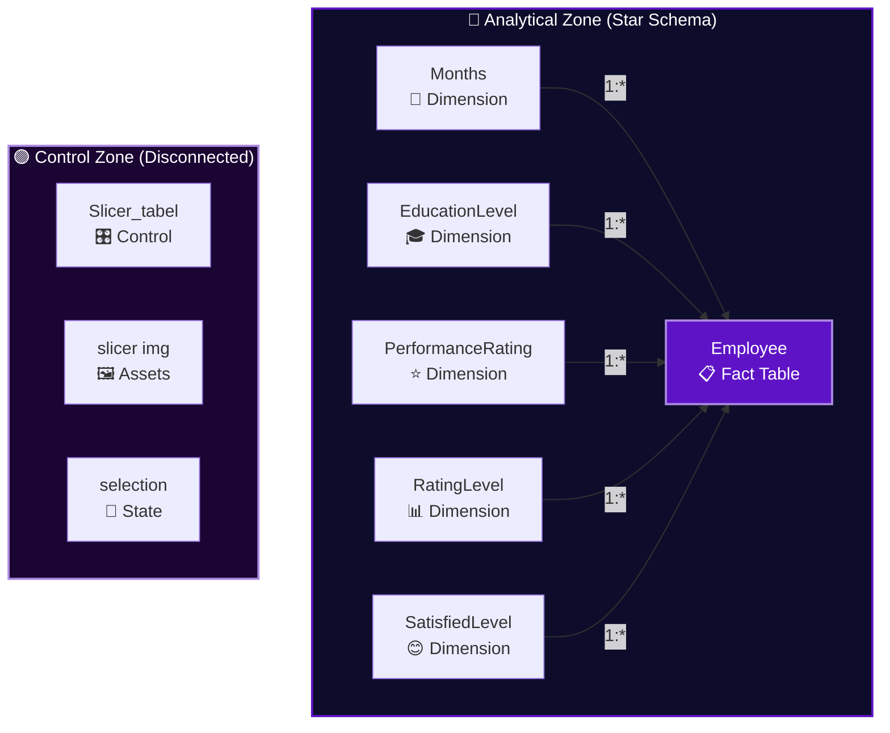
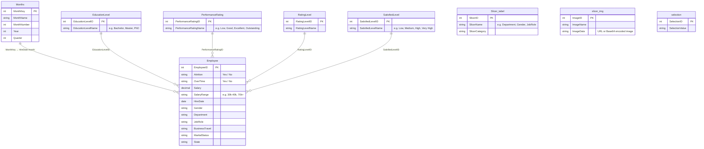
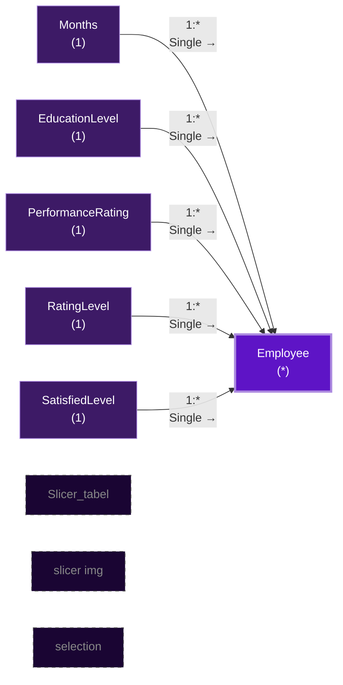
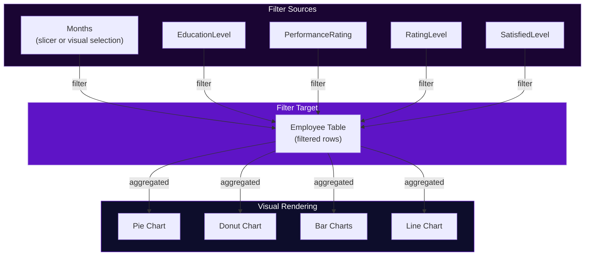
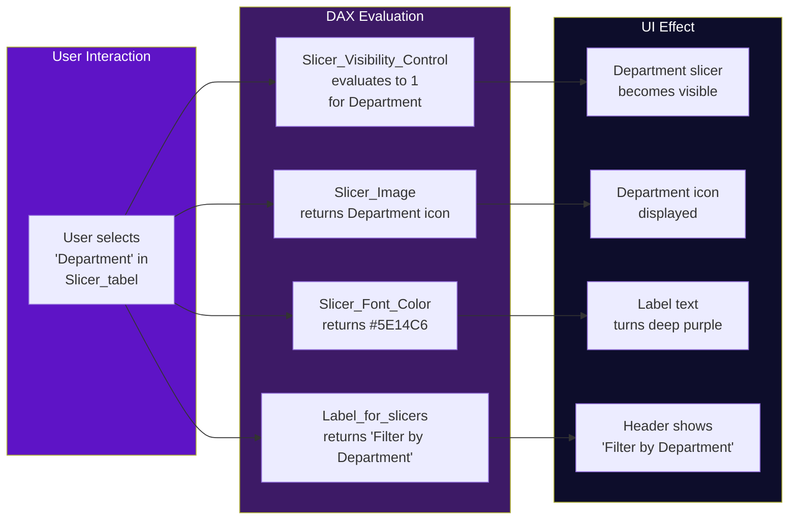

# 📊 Tesla Employee Insights — Data Model Reference

> **Dashboard**: Tesla Employee Insights  
> **Schema Pattern**: Star Schema (with disconnected control tables)  
> **Engine**: Power BI VertiPaq (in-memory columnar)  
> **Last Updated**: June 2026

---

## Table of Contents

- [1. Model Overview](#1-model-overview)
- [2. Entity-Relationship Diagram](#2-entity-relationship-diagram)
- [3. Table Specifications](#3-table-specifications)
  - [3.1 Employee (Fact Table)](#31-employee-fact-table)
  - [3.2 Months (Date Dimension)](#32-months-date-dimension)
  - [3.3 EducationLevel (Dimension)](#33-educationlevel-dimension)
  - [3.4 PerformanceRating (Dimension)](#34-performancerating-dimension)
  - [3.5 RatingLevel (Dimension)](#35-ratinglevel-dimension)
  - [3.6 SatisfiedLevel (Dimension)](#36-satisfiedlevel-dimension)
  - [3.7 Slicer_tabel (Disconnected Control Table)](#37-slicer_tabel-disconnected-control-table)
  - [3.8 slicer img (Asset Table)](#38-slicer-img-asset-table)
  - [3.9 selection (State Tracking Table)](#39-selection-state-tracking-table)
- [4. Relationships & Cardinality](#4-relationships--cardinality)
- [5. Star Schema Discussion](#5-star-schema-discussion)
- [6. Filter Direction & Propagation](#6-filter-direction--propagation)
- [7. Disconnected Table Pattern](#7-disconnected-table-pattern)
- [8. Optimization Considerations](#8-optimization-considerations)

---

## 1. Model Overview

The Tesla Employee Insights data model follows a **modified star schema** with two distinct zones:

1. **Analytical Zone** — A classic star schema with the `Employee` fact table at the center, surrounded by dimension tables (`Months`, `EducationLevel`, `PerformanceRating`, `RatingLevel`, `SatisfiedLevel`) that provide lookup/context data.

2. **Control Zone** — Three disconnected tables (`Slicer_tabel`, `slicer img`, `selection`) that have **no relationships** to the analytical zone. These tables drive the Dynamic Filter Engine's UI behavior without contaminating the data model's filter chain.



> [!IMPORTANT]
> The Control Zone tables are **intentionally disconnected**. They must never be joined to the Employee table. Their purpose is to control UI behavior (slicer visibility, icons, selection state) through DAX measures, not to filter data.

---

## 2. Entity-Relationship Diagram



> [!NOTE]
> The `Slicer_tabel`, `slicer_img`, and `selection` tables have no relationship lines in the ER diagram because they are disconnected from the analytical model. Their interaction with the dashboard is purely through DAX measure evaluation.

---

## 3. Table Specifications

### 3.1 Employee (Fact Table)

The central fact table containing one row per employee. This is the **only fact table** in the model and is the source for all chart visuals.

| Column | Data Type | Description | Used By Visual |
|--------|-----------|-------------|----------------|
| `EmployeeID` | Integer (PK) | Unique employee identifier. Used as the aggregation base (`Count of EmployeeID`) in all charts. | Pie, Donut, Bar Charts, Line Chart |
| `Attrition` | Text (Yes/No) | Whether the employee has left the organization. | Pie Chart (category axis) |
| `OverTime` | Text (Yes/No) | Whether the employee works overtime. | Donut Chart (category axis) |
| `Salary` | Decimal | Employee's annual salary value. | Underlying data for Salary Range derivation |
| `Salary Range` | Text | Binned salary ranges (e.g., "10k-20k", "20k-30k", ..., "60k-70k", "70k+"). Created during Power Query transformation. | Bar Chart #1 (excludes 70k+), Bar Chart #2 (70k+ only) |
| `HireDate` | Date | Date the employee was hired. Supports Year → Quarter → Month drill-down hierarchy. | Line Chart (category axis, month hierarchy) |
| `Gender` | Text | Employee gender (e.g., Male, Female, Non-binary). | Slicer Panel filter |
| `Department` | Text | Department assignment (e.g., Engineering, Sales, HR, R&D). | Slicer Panel filter |
| `JobRole` | Text | Specific job role/title within the department. | Slicer Panel filter |
| `BusinessTravel` | Text | Travel frequency (e.g., Travel_Rarely, Travel_Frequently, Non-Travel). | Slicer Panel filter |
| `MaritalStatus` | Text | Marital status (e.g., Single, Married, Divorced). | Slicer Panel filter |
| `State` | Text | US state of employment/residence. | Available for filtering; not displayed in a dedicated visual |

> [!TIP]
> The `Salary Range` column is derived during Power Query transformation, not computed by DAX. This is optimal because:
> 1. Binning is a one-time operation (runs at data refresh, not per query).
> 2. VertiPaq can compress the resulting text column efficiently (low cardinality — only ~7 distinct values).
> 3. DAX `SWITCH()` or `IF()` for binning would execute on every visual render.

### 3.2 Months (Date Dimension)

A date dimension table supporting the Line Chart's temporal analysis and the HireDate hierarchy.

| Column / Measure | Type | Description |
|------------------|------|-------------|
| `MonthKey` | Integer (PK) | Surrogate key for the month (e.g., 202301 for Jan 2023) |
| `MonthName` | Text | Display name (e.g., "January", "February") |
| `MonthNumber` | Integer | Numeric month (1–12) for sorting |
| `Year` | Integer | Calendar year |
| `Quarter` | Integer | Calendar quarter (1–4) |
| **`Slicer count`** | **Measure** | Counts the number of active slicer filters. Displayed in the Action Button. |
| **`button text color`** | **Measure** | Returns a hex color code for the Action Button's font. Changes when filters are active. |

> [!NOTE]
> The `Slicer count` and `button text color` measures are **hosted in the Months table** but are logically part of the Dynamic Filter Engine. This is a common Power BI pattern — measures must be assigned to a table, and the Months table serves as a convenient "home" for general-purpose measures.

### 3.3 EducationLevel (Dimension)

Lookup table mapping education level codes to readable labels.

| Column | Data Type | Description | Example Values |
|--------|-----------|-------------|----------------|
| `EducationLevelID` | Integer (PK) | Numeric education code | 1, 2, 3, 4, 5 |
| `EducationLevelName` | Text | Human-readable label | Below College, College, Bachelor's, Master's, Doctor |

**Relationship**: `EducationLevel[EducationLevelID]` → `Employee[EducationLevel]` (1:Many, single direction → Employee)

### 3.4 PerformanceRating (Dimension)

Lookup table for performance rating categories.

| Column | Data Type | Description | Example Values |
|--------|-----------|-------------|----------------|
| `PerformanceRatingID` | Integer (PK) | Numeric rating code | 1, 2, 3, 4 |
| `PerformanceRatingName` | Text | Rating label | Low, Good, Excellent, Outstanding |

**Relationship**: `PerformanceRating[PerformanceRatingID]` → `Employee[PerformanceRating]` (1:Many, single direction → Employee)

### 3.5 RatingLevel (Dimension)

Generic rating-level lookup, potentially used for additional rating dimensions (e.g., manager rating, self-assessment).

| Column | Data Type | Description | Example Values |
|--------|-----------|-------------|----------------|
| `RatingLevelID` | Integer (PK) | Numeric level code | 1, 2, 3, 4 |
| `RatingLevelName` | Text | Level label | Low, Medium, High, Very High |

**Relationship**: `RatingLevel[RatingLevelID]` → `Employee[RatingLevel]` (1:Many, single direction → Employee)

### 3.6 SatisfiedLevel (Dimension)

Lookup table for employee satisfaction survey categories.

| Column | Data Type | Description | Example Values |
|--------|-----------|-------------|----------------|
| `SatisfiedLevelID` | Integer (PK) | Numeric satisfaction code | 1, 2, 3, 4 |
| `SatisfiedLevelName` | Text | Satisfaction label | Low, Medium, High, Very High |

**Relationship**: `SatisfiedLevel[SatisfiedLevelID]` → `Employee[SatisfiedLevel]` (1:Many, single direction → Employee)

### 3.7 Slicer_tabel (Disconnected Control Table)

The heart of the Dynamic Filter Engine. This table contains one row per slicer category and drives slicer visibility, icons, and labels through DAX measures.

| Column / Measure | Type | Description |
|------------------|------|-------------|
| `SlicerID` | Integer (PK) | Unique identifier for each slicer category |
| `SlicerName` | Text | Name of the slicer (e.g., "Department", "Gender", "JobRole", "BusinessTravel", "MaritalStatus") |
| `SlicerCategory` | Text | Optional grouping (e.g., "Basic", "Advanced") |
| **`Slicer_Image`** | **Measure** | Returns the image URL or Base64 data for the slicer's icon. Sources from the `slicer img` table. |
| **`Slicer_Font_Color`** | **Measure** | Returns a hex color code based on whether this slicer is active. Active: `#5E14C6`; Inactive: muted gray. |
| **`Slicer_Visibility_Control`** | **Measure** | Returns `1` (show) or `0` (hide) for each slicer. Controls visibility on the Slicer Panel tooltip page. |
| **`Selected Slicer`** | **Measure** | Returns the name of the currently selected slicer category. Used for context in other measures. |
| **`Label_for_slicers`** | **Measure** | Returns dynamic label text (e.g., "Filter by Department") for slicer headers. |

**Relationships**: **NONE** — This table is intentionally disconnected from the data model.

> [!WARNING]
> Never create a relationship between `Slicer_tabel` and any other table. Doing so would cause the entire fact table to be filtered whenever a slicer category row is selected, breaking the UI-control pattern and producing incorrect results in all charts.

### 3.8 slicer img (Asset Table)

Stores image references (URLs or Base64-encoded images) used as icons in the slicer panel.

| Column | Data Type | Description |
|--------|-----------|-------------|
| `ImageID` | Integer (PK) | Image identifier |
| `ImageName` | Text | Descriptive name (maps to slicer category) |
| `ImageData` | Text | Image URL or Base64-encoded image string |

**Relationships**: **NONE** — Accessed via the `Slicer_Image` measure in `Slicer_tabel`, not through a model relationship.

### 3.9 selection (State Tracking Table)

Maintains selection state for the dynamic filter system.

| Column | Data Type | Description |
|--------|-----------|-------------|
| `SelectionID` | Integer (PK) | Selection identifier |
| `SelectionValue` | Text | Current selection state value |

**Relationships**: **NONE** — Consumed by the `Selected Slicer` measure through DAX evaluation.

---

## 4. Relationships & Cardinality

### Relationship Summary Table

| From Table (One Side) | From Column | → | To Table (Many Side) | To Column | Cardinality | Filter Direction | Active |
|----------------------|-------------|---|---------------------|-----------|-------------|-----------------|--------|
| `Months` | `MonthKey` | → | `Employee` | HireDate (month key) | 1:Many | Single (→ Employee) | ✅ Yes |
| `EducationLevel` | `EducationLevelID` | → | `Employee` | EducationLevel | 1:Many | Single (→ Employee) | ✅ Yes |
| `PerformanceRating` | `PerformanceRatingID` | → | `Employee` | PerformanceRating | 1:Many | Single (→ Employee) | ✅ Yes |
| `RatingLevel` | `RatingLevelID` | → | `Employee` | RatingLevel | 1:Many | Single (→ Employee) | ✅ Yes |
| `SatisfiedLevel` | `SatisfiedLevelID` | → | `Employee` | SatisfiedLevel | 1:Many | Single (→ Employee) | ✅ Yes |
| `Slicer_tabel` | — | — | — | — | **None** | — | N/A |
| `slicer img` | — | — | — | — | **None** | — | N/A |
| `selection` | — | — | — | — | **None** | — | N/A |

### Relationship Diagram



*Dashed borders indicate disconnected tables with no model relationships.*

---

## 5. Star Schema Discussion

### Why Star Schema?

The Tesla Employee Insights dashboard uses a **star schema** — the industry-standard design pattern for analytical BI solutions — for the following reasons:

| Benefit | How It Applies Here |
|---------|---------------------|
| **Query Performance** | VertiPaq's columnar engine is optimized for star schemas. Filters applied to dimension tables (e.g., `EducationLevel`) propagate efficiently to the `Employee` fact table through single-direction relationships. |
| **Simplicity** | With one fact table and five dimension tables, the model is easy to understand. There are no snowflake chains or complex many-to-many bridges. |
| **DAX Compatibility** | DAX functions like `CALCULATE()`, `FILTER()`, `ALL()`, and `RELATED()` are designed with star schemas in mind. Filter context flows naturally from dimensions to facts. |
| **Slicer Performance** | Slicers on dimension columns (e.g., Department, Gender) leverage VertiPaq's dictionary encoding — the distinct values are already indexed, making slicer population instant. |
| **Scalability** | Additional dimensions (e.g., a Location table, a Job Band table) can be added by creating a new table and a single relationship to `Employee`, without modifying existing tables. |

### Schema Classification

```
┌─────────────────────────────────────────────┐
│              STAR SCHEMA                     │
│                                              │
│    Months ─────┐                             │
│    EducationLevel ──┐                        │
│    PerformanceRating ──┐                     │
│    RatingLevel ─────────→ EMPLOYEE (Fact)    │
│    SatisfiedLevel ──────┘                    │
│                                              │
│              DISCONNECTED ISLANDS            │
│                                              │
│    Slicer_tabel    (UI Control)              │
│    slicer img      (Assets)                  │
│    selection       (State)                   │
│                                              │
└─────────────────────────────────────────────┘
```

> [!NOTE]
> This model is **not** a snowflake schema. None of the dimension tables have further normalization (e.g., EducationLevel doesn't have a sub-dimension). Each dimension connects directly to the fact table — a defining characteristic of the star pattern.

---

## 6. Filter Direction & Propagation

### Single-Direction Filtering

All relationships use **single-direction filtering** (Dimension → Fact). This means:

1. **Selecting a value in a dimension table** (e.g., `EducationLevel = "Master's"`) filters the `Employee` table to show only employees with that education level.
2. **Selecting a value in the Employee table** (e.g., clicking a bar in the salary chart) does **not** back-filter dimension tables.

This is the recommended approach for star schemas because:

- It prevents ambiguous filter paths
- It avoids bidirectional performance penalties
- It keeps the model predictable for DAX authors

### Filter Propagation Flow



### Cross-Filtering vs. Model Filtering

| Mechanism | Scope | How It Works |
|-----------|-------|--------------|
| **Model Relationships** | Dimension → Fact | Single-direction filter propagation through defined relationships. Triggered by slicers or visual filters. |
| **Cross-Filtering** (`drillFilterOtherVisuals: true`) | Visual → Visual | When a user clicks a data point in one visual, all other visuals on the page receive a temporary filter context. This does not use model relationships — it's a Power BI rendering feature. |
| **Slicer Panel Sync** (`syncGroup: "slicer"`) | Page → Page | Slicer selections on the tooltip page persist and sync to the main page via the sync group. This ensures filters remain active after the tooltip closes. |

---

## 7. Disconnected Table Pattern

### Architecture Rationale

The three disconnected tables (`Slicer_tabel`, `slicer img`, `selection`) implement the **Disconnected Table pattern** — a well-established Power BI design pattern for:

1. **Parameter tables** — Allowing users to select non-data values (e.g., "which slicer to show") without affecting data filters.
2. **What-if analysis** — Providing inputs to DAX calculations without joining to the fact table.
3. **UI state management** — Tracking visual state (selected slicer, visibility flags) in a queryable structure.

### How It Works in This Dashboard



> [!CAUTION]
> If a developer accidentally creates a relationship between `Slicer_tabel` and `Employee`, the following will break:
> - All chart visuals will be filtered by the Slicer_tabel's selected row (showing incorrect counts)
> - The `Slicer_Visibility_Control` measure may not evaluate correctly due to unexpected filter context
> - The `Slicer count` measure may include the Slicer_tabel's own selection in its count

---

## 8. Optimization Considerations

### VertiPaq Compression

| Table | Est. Rows | Compression Strategy | Notes |
|-------|-----------|---------------------|-------|
| `Employee` | 1,000–50,000 | Dictionary encoding on all text columns | Low-cardinality columns (`Attrition`: 2 values, `OverTime`: 2 values, `Gender`: 2–3 values) compress extremely well |
| `Months` | 12–120 | Minimal footprint | Even with 10 years of monthly data, this table is tiny |
| `EducationLevel` | 5 | Negligible | Dictionary = 5 entries |
| `PerformanceRating` | 3–5 | Negligible | Dictionary = 3–5 entries |
| `RatingLevel` | 3–5 | Negligible | Dictionary = 3–5 entries |
| `SatisfiedLevel` | 3–5 | Negligible | Dictionary = 3–5 entries |
| `Slicer_tabel` | 5–10 | Negligible | One row per slicer category |
| `slicer img` | 5–10 | Image data may be larger | If using Base64, each image string can be 10–50 KB |
| `selection` | 1–5 | Negligible | State tracking only |

### Column-Level Optimization

| Optimization | Applied To | Benefit |
|-------------|-----------|---------|
| **Avoid high-cardinality text columns** | `Employee[EmployeeID]` is integer, not text | Integers compress better than text in VertiPaq |
| **Pre-computed bins** | `Employee[Salary Range]` created in Power Query | Avoids runtime DAX binning on every render |
| **Date hierarchy** | `Employee[HireDate]` with auto-hierarchy | VertiPaq natively optimizes date hierarchies for drill-down |
| **No unused columns** | All Employee columns are used by at least one visual or slicer | Reduces dictionary size and memory footprint |

### Relationship Optimization

| Best Practice | Status in This Model |
|---------------|---------------------|
| All relationships are single-direction | ✅ Yes |
| No many-to-many relationships | ✅ Yes |
| No bidirectional cross-filtering | ✅ Yes |
| No ambiguous relationship paths | ✅ Yes |
| No circular dependencies | ✅ Yes |
| Disconnected tables have zero relationships | ✅ Yes |

### Query Performance Tips

1. **Implicit measures over explicit for simple counts**: The `Count of EmployeeID` used in charts is an implicit measure (auto-aggregation). This is faster than an explicit `COUNTROWS(Employee)` because Power BI can optimize implicit aggregations at the storage engine level.

2. **Avoid `CALCULATE()` with full-table iteration**: Measures like `Slicer count` should use `ISFILTERED()` checks rather than iterating through all slicer values. `ISFILTERED()` is metadata-only — it checks the filter context without scanning data.

3. **Keep Slicer_tabel small**: Since its measures are evaluated for every row in the table (for conditional formatting), more rows = more evaluations. Five to ten rows is ideal.

---

> [!TIP]
> For the complete architecture overview and data flow diagrams, see [architecture.md](architecture.md). For DAX measure formulas and documentation, see [dax-reference.md](dax-reference.md).
