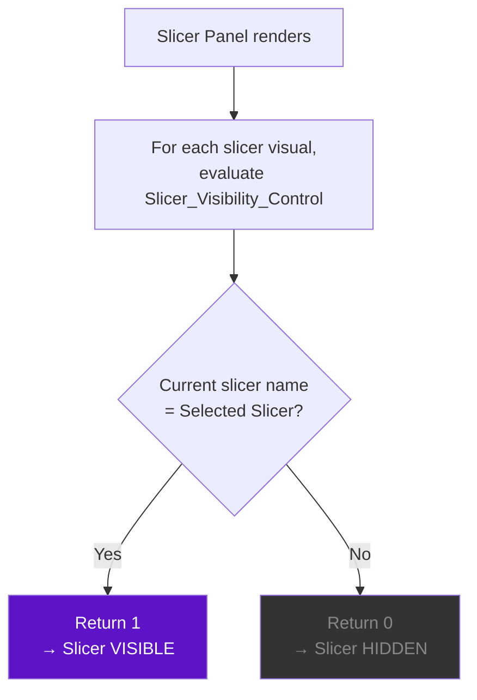
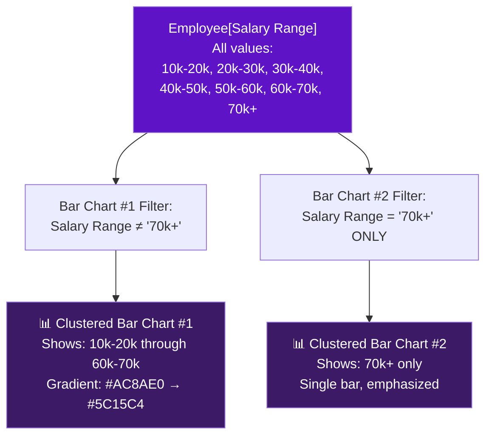
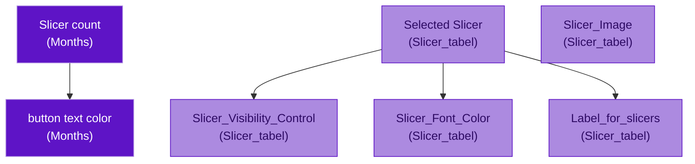

# 📐 Tesla Employee Insights — DAX Measure Reference

> **Dashboard**: Tesla Employee Insights  
> **DAX Engine**: Power BI VertiPaq  
> **Convention**: All inferred formulas are labeled `[Inferred]`  
> **Last Updated**: June 2026

---

## Table of Contents

- [1. Measure Index](#1-measure-index)
- [2. Dynamic Filter Engine Measures](#2-dynamic-filter-engine-measures)
  - [2.1 Slicer count](#21-slicer-count)
  - [2.2 button text color](#22-button-text-color)
  - [2.3 Slicer_Image](#23-slicer_image)
  - [2.4 Slicer_Font_Color](#24-slicer_font_color)
  - [2.5 Slicer_Visibility_Control](#25-slicer_visibility_control)
  - [2.6 Selected Slicer](#26-selected-slicer)
  - [2.7 Label_for_slicers](#27-label_for_slicers)
- [3. Implicit Measures](#3-implicit-measures)
  - [3.1 Count of EmployeeID](#31-count-of-employeeid)
  - [3.2 Salary Range Aggregation](#32-salary-range-aggregation)
- [4. Measure Dependency Graph](#4-measure-dependency-graph)
- [5. DAX Pattern Catalog](#5-dax-pattern-catalog)
- [6. Testing & Validation](#6-testing--validation)

---

## 1. Measure Index

| # | Measure Name | Home Table | Category | Used By |
|---|-------------|------------|----------|---------|
| 1 | `Slicer count` | Months | Filter Engine | Action Button (value) |
| 2 | `button text color` | Months | Filter Engine | Action Button (font color) |
| 3 | `Slicer_Image` | Slicer_tabel | Filter Engine | Slicer Panel (icon images) |
| 4 | `Slicer_Font_Color` | Slicer_tabel | Filter Engine | Slicer Panel (label color) |
| 5 | `Slicer_Visibility_Control` | Slicer_tabel | Filter Engine | Slicer Panel (show/hide) |
| 6 | `Selected Slicer` | Slicer_tabel | Filter Engine | Internal (context for other measures) |
| 7 | `Label_for_slicers` | Slicer_tabel | Filter Engine | Slicer Panel (header text) |
| I1 | `Count of EmployeeID` | Employee | Implicit | Pie, Donut, Bar Charts, Line Chart |
| I2 | Salary Range Aggregation | Employee | Implicit | Bar Charts (category axis) |

---

## 2. Dynamic Filter Engine Measures

### 2.1 Slicer count

> Counts the total number of active slicer filters applied by the user. Displayed as a numeric badge in the Action Button on the main page.

**Home Table**: `Months`  
**Return Type**: Integer  
**Used By**: Action Button (displays the count value)

#### Formula `[Inferred]`

```dax
Slicer count =
VAR _DeptFiltered    = ISFILTERED( Employee[Department] )
VAR _GenderFiltered  = ISFILTERED( Employee[Gender] )
VAR _JobFiltered     = ISFILTERED( Employee[JobRole] )
VAR _TravelFiltered  = ISFILTERED( Employee[BusinessTravel] )
VAR _MaritalFiltered = ISFILTERED( Employee[MaritalStatus] )
VAR _EduFiltered     = ISFILTERED( EducationLevel[EducationLevelName] )
VAR _PerfFiltered    = ISFILTERED( PerformanceRating[PerformanceRatingName] )
VAR _RateFiltered    = ISFILTERED( RatingLevel[RatingLevelName] )
VAR _SatFiltered     = ISFILTERED( SatisfiedLevel[SatisfiedLevelName] )
RETURN
    _DeptFiltered + _GenderFiltered + _JobFiltered +
    _TravelFiltered + _MaritalFiltered + _EduFiltered +
    _PerfFiltered + _RateFiltered + _SatFiltered + 0
```

#### How It Works

| Step | Description |
|------|-------------|
| 1 | Each `ISFILTERED()` call checks whether the specified column has an active filter in the current context. Returns `TRUE` (1) or `FALSE` (0). |
| 2 | The results are summed. Since `TRUE` = 1 and `FALSE` = 0 in DAX arithmetic, the sum equals the number of active filters. |
| 3 | The `+ 0` at the end ensures the result is coerced to an integer (defensive pattern). |
| 4 | The Action Button displays this value. When `Slicer count = 0`, no filters are active. When `Slicer count = 3`, three distinct slicer columns have selections. |

#### Business Value

- **User awareness**: Users instantly see how many filters are shaping their current view, preventing "hidden filter" confusion.
- **Reset prompt**: A non-zero count signals that the dashboard is in a filtered state and may not show all data.

#### Optimization Notes

- `ISFILTERED()` is a **metadata-only** function — it inspects the query's filter context without scanning data rows. This makes it extremely fast even on large datasets.
- **Alternative considered**: `COUNTROWS(ALLSELECTED(Employee[Department])) <> COUNTROWS(ALL(Employee[Department]))` — this would work but is significantly slower because it materializes row sets.
- The measure is hosted in the `Months` table because it's a general-purpose measure not logically tied to any specific table. The Months table acts as a "measures home."

---

### 2.2 button text color

> Returns a hex color code for the Action Button's font, changing dynamically based on whether any filters are active.

**Home Table**: `Months`  
**Return Type**: Text (hex color string)  
**Used By**: Action Button (conditional font color formatting)

#### Formula `[Inferred]`

```dax
button text color =
IF(
    [Slicer count] > 0,
    "#5E14C6",    -- Deep purple when filters are active
    "#AC8AE0"     -- Light purple when no filters are active
)
```

#### How It Works

| State | Slicer count | Returned Color | Visual Effect |
|-------|-------------|----------------|---------------|
| No filters active | 0 | `#AC8AE0` (light purple) | Button text appears muted/subtle, blending with the background |
| One or more filters active | ≥ 1 | `#5E14C6` (deep purple) | Button text becomes bold/prominent, drawing attention to the active filter state |

#### Business Value

- **Visual affordance**: Users can tell at a glance whether filters are active without reading the number. The color shift acts as a visual alert.
- **Brand consistency**: Both color states use the dashboard's purple palette, maintaining design coherence.

#### Optimization Notes

- This measure depends on `[Slicer count]`. Power BI's engine caches measure results within the same query, so `[Slicer count]` is not re-evaluated — the cached result is reused.
- The `IF()` function is the simplest conditional in DAX — it evaluates in constant time with no iteration.

---

### 2.3 Slicer_Image

> Returns an image reference (URL or Base64-encoded data) for the icon displayed alongside each slicer category in the Slicer Panel.

**Home Table**: `Slicer_tabel`  
**Return Type**: Text (image URL or Base64 string)  
**Used By**: Slicer Panel (image column in slicer list)

#### Formula `[Inferred]`

```dax
Slicer_Image =
VAR _CurrentSlicer = SELECTEDVALUE( Slicer_tabel[SlicerName], "" )
VAR _ImageLookup =
    SWITCH(
        _CurrentSlicer,
        "Department",      LOOKUPVALUE( 'slicer img'[ImageData], 'slicer img'[ImageName], "Department" ),
        "Gender",          LOOKUPVALUE( 'slicer img'[ImageData], 'slicer img'[ImageName], "Gender" ),
        "JobRole",         LOOKUPVALUE( 'slicer img'[ImageData], 'slicer img'[ImageName], "JobRole" ),
        "BusinessTravel",  LOOKUPVALUE( 'slicer img'[ImageData], 'slicer img'[ImageName], "BusinessTravel" ),
        "MaritalStatus",   LOOKUPVALUE( 'slicer img'[ImageData], 'slicer img'[ImageName], "MaritalStatus" ),
        BLANK()
    )
RETURN
    _ImageLookup
```

#### How It Works

| Step | Description |
|------|-------------|
| 1 | `SELECTEDVALUE()` retrieves the current row's `SlicerName` from the `Slicer_tabel` filter context. In a table/matrix visual, this is evaluated per row. |
| 2 | `SWITCH()` maps each slicer name to a `LOOKUPVALUE()` call against the `slicer img` table. |
| 3 | `LOOKUPVALUE()` retrieves the image data (URL or Base64 string) from the `slicer img` table, matching on `ImageName`. |
| 4 | The returned string is rendered as an image by Power BI's Image URL data category. |

#### Business Value

- **Visual recognition**: Icons help users quickly identify which slicer category they're interacting with, reducing cognitive load in a list of text labels.
- **Professional polish**: Icon-decorated slicer lists elevate the dashboard's visual quality.

#### Optimization Notes

- `LOOKUPVALUE()` on a disconnected table with 5–10 rows is effectively a constant-time hash lookup. No performance concern.
- **Alternative**: If `slicer img` had a relationship to `Slicer_tabel`, a simple `RELATED()` call would suffice. The disconnected design was chosen to keep the control tables completely isolated.
- If using Base64 images, be aware that each string can be 10–50 KB. With only 5–10 rows, total memory impact is negligible (~250 KB max).

---

### 2.4 Slicer_Font_Color

> Returns a hex color code for each slicer label's font, highlighting the currently active/selected slicer category in the Slicer Panel.

**Home Table**: `Slicer_tabel`  
**Return Type**: Text (hex color string)  
**Used By**: Slicer Panel (conditional font color on slicer category labels)

#### Formula `[Inferred]`

```dax
Slicer_Font_Color =
VAR _CurrentSlicer = SELECTEDVALUE( Slicer_tabel[SlicerName], "" )
VAR _SelectedSlicer = [Selected Slicer]
RETURN
    IF(
        _CurrentSlicer = _SelectedSlicer,
        "#5E14C6",    -- Deep purple for the active slicer
        "#888888"     -- Muted gray for inactive slicers
    )
```

#### How It Works

| Condition | Color Returned | Visual Effect |
|-----------|---------------|---------------|
| Current row's slicer = selected slicer | `#5E14C6` (deep purple) | Label is prominent, indicating this slicer's filter panel is currently shown |
| Current row's slicer ≠ selected slicer | `#888888` (gray) | Label is muted, indicating this slicer is available but not currently in focus |

#### Business Value

- **Navigation clarity**: Users instantly see which slicer category is active/expanded in the panel.
- **Accessibility**: The contrast ratio between `#5E14C6` (active) and `#888888` (inactive) provides clear visual distinction.

#### Optimization Notes

- Depends on `[Selected Slicer]`, which is cached within the same query context.
- `SELECTEDVALUE()` is O(1) — it reads the current filter context, not data rows.
- The `IF()` comparison is a simple string equality check.

---

### 2.5 Slicer_Visibility_Control

> The core measure of the Dynamic Filter Engine. Returns `1` to show a slicer or `0` to hide it, controlling which slicer is visible on the Slicer Panel tooltip page.

**Home Table**: `Slicer_tabel`  
**Return Type**: Integer (1 or 0)  
**Used By**: Slicer Panel (visibility binding via syncGroup "slicer")

#### Formula `[Inferred]`

```dax
Slicer_Visibility_Control =
VAR _CurrentSlicer = SELECTEDVALUE( Slicer_tabel[SlicerName], "" )
VAR _SelectedSlicer = [Selected Slicer]
RETURN
    IF(
        _CurrentSlicer = _SelectedSlicer,
        1,    -- Show this slicer
        0     -- Hide this slicer
    )
```

#### How It Works



| Scenario | Selected Slicer Value | Department Slicer | Gender Slicer | JobRole Slicer |
|----------|----------------------|-------------------|---------------|----------------|
| User selects "Department" | "Department" | **1 (visible)** | 0 (hidden) | 0 (hidden) |
| User selects "Gender" | "Gender" | 0 (hidden) | **1 (visible)** | 0 (hidden) |
| User selects "JobRole" | "JobRole" | 0 (hidden) | 0 (hidden) | **1 (visible)** |
| No selection | "" | 0 (hidden) | 0 (hidden) | 0 (hidden) |

#### Business Value

- **Space efficiency**: Only one slicer is shown at a time, preventing the panel from becoming cluttered with multiple dropdowns.
- **Progressive disclosure**: Users choose which filter dimension to explore, reducing information overload.
- **Clean UX**: The show/hide mechanism creates an accordion-like experience within the tooltip page.

#### Optimization Notes

- This measure is evaluated once per slicer visual on the panel (5–10 evaluations total). Each evaluation is O(1).
- **Critical constraint**: The `Slicer_tabel` must remain disconnected. If it had a relationship to `Employee`, the `SELECTEDVALUE()` call would be polluted by the Employee table's filter context.
- In Power BI, visual visibility bound to a measure requires the visual's "Visibility" property to reference this measure through conditional formatting rules.

---

### 2.6 Selected Slicer

> Tracks which slicer category the user has currently selected. Acts as the source-of-truth for `Slicer_Font_Color` and `Slicer_Visibility_Control`.

**Home Table**: `Slicer_tabel`  
**Return Type**: Text (slicer name string)  
**Used By**: Internal — consumed by `Slicer_Font_Color`, `Slicer_Visibility_Control`, `Label_for_slicers`

#### Formula `[Inferred]`

```dax
Selected Slicer =
IF(
    HASONEVALUE( Slicer_tabel[SlicerName] ),
    VALUES( Slicer_tabel[SlicerName] ),
    IF(
        NOT ISEMPTY( selection ),
        SELECTEDVALUE( selection[SelectionValue], "" ),
        ""
    )
)
```

#### How It Works

| Step | Description |
|------|-------------|
| 1 | `HASONEVALUE()` checks if exactly one `SlicerName` value is in the current filter context (i.e., the user clicked a single slicer category). |
| 2 | If yes, `VALUES()` returns that single slicer name (e.g., "Department"). |
| 3 | If no single value is selected (e.g., panel just opened, or multiple selections), it falls back to the `selection` table to retrieve the last-stored selection. |
| 4 | If the `selection` table is also empty, returns an empty string (no slicer selected). |

#### Business Value

- **State persistence**: Even when the filter context changes (e.g., user navigates back to the main page), this measure can recall the last selection via the `selection` table.
- **Foundation measure**: Three other measures depend on this value, making it the keystone of the Dynamic Filter Engine.

#### Optimization Notes

- `HASONEVALUE()` and `VALUES()` are both O(1) metadata operations on a disconnected table with < 10 rows.
- The `selection` table fallback ensures resilience when the `Slicer_tabel` filter context is ambiguous.

---

### 2.7 Label_for_slicers

> Generates dynamic header text for the currently visible slicer section (e.g., "Filter by Department").

**Home Table**: `Slicer_tabel`  
**Return Type**: Text  
**Used By**: Slicer Panel (header/title text above the active slicer)

#### Formula `[Inferred]`

```dax
Label_for_slicers =
VAR _SelectedSlicer = [Selected Slicer]
RETURN
    IF(
        _SelectedSlicer <> "",
        "Filter by " & _SelectedSlicer,
        "Select a Filter"
    )
```

#### How It Works

| Selected Slicer Value | Label Output |
|-----------------------|-------------|
| "Department" | "Filter by Department" |
| "Gender" | "Filter by Gender" |
| "JobRole" | "Filter by JobRole" |
| "BusinessTravel" | "Filter by BusinessTravel" |
| "MaritalStatus" | "Filter by MaritalStatus" |
| "" (none selected) | "Select a Filter" |

#### Business Value

- **Contextual guidance**: Users always know which dimension they're currently filtering, reducing confusion in a single-slicer-at-a-time panel.
- **Instructional default**: "Select a Filter" acts as an onboarding prompt when no slicer is chosen.

#### Optimization Notes

- Simple string concatenation with one measure dependency. Negligible compute cost.
- The `IF()` guard prevents displaying "Filter by " (with trailing space) when no slicer is selected.

---

## 3. Implicit Measures

Implicit measures are auto-generated by Power BI when a column is dragged to a visual's value well. They are not defined in DAX but behave as if they are.

### 3.1 Count of EmployeeID

> Counts the number of employees (rows) in the current filter context. Used as the primary metric in all four chart types.

**Source Column**: `Employee[EmployeeID]`  
**Aggregation**: Count (COUNTA)  
**Used By**: Pie Chart, Donut Chart, Bar Chart #1, Bar Chart #2, Line Chart

#### Equivalent Explicit DAX `[Inferred]`

```dax
Count of EmployeeID =
COUNTA( Employee[EmployeeID] )
```

#### Visual Usage

| Visual | Role of Count of EmployeeID | Filter Context |
|--------|----------------------------|----------------|
| **Pie Chart** | Size of each slice (Attrition = Yes vs. No) | Grouped by `Employee[Attrition]`, labels show % of total |
| **Donut Chart** | Size of each ring segment (OverTime = Yes vs. No) | Grouped by `Employee[OverTime]` |
| **Bar Chart #1** | Bar length for each salary range | Grouped by `Employee[Salary Range]`, filtered to exclude "70k+" |
| **Bar Chart #2** | Bar length for the 70k+ band | Grouped by `Employee[Salary Range]`, filtered to "70k+" only |
| **Line Chart** | Y-axis value at each month point | Grouped by `Employee[HireDate]` (Month hierarchy), shows hiring volume over time |

#### Business Value

- **Universal metric**: Employee count is the fundamental measure for all workforce analytics — attrition rates, overtime distribution, salary distribution, and hiring trends.
- **Consistency**: Using the same aggregation across all visuals ensures users can compare values across charts without mental translation.

#### Optimization Notes

- `COUNTA` on an integer column (`EmployeeID`) is one of the fastest aggregations in VertiPaq. The engine can use the column's segment metadata (row count per segment) without scanning individual values.
- **Why COUNTA, not COUNTROWS?**: Power BI's implicit measure for a column drag uses `COUNTA` (count non-blank values in that column). Since `EmployeeID` is a primary key with no blanks, this is equivalent to `COUNTROWS(Employee)` but is the default behavior when dragging a column to the Values well.

---

### 3.2 Salary Range Aggregation

> The Salary Range column is used as a **category axis** (not a value aggregation). Power BI groups the Employee table by `Salary Range` and counts employees per group.

**Source Column**: `Employee[Salary Range]`  
**Role**: Category (grouping), not value (aggregation)  
**Used By**: Bar Chart #1 (category axis), Bar Chart #2 (category axis)

#### How the Two Bar Charts Split the Data



#### Salary Range Values & Expected Sort Order

| Salary Range | Sort Position | Bar Chart | Visual Treatment |
|-------------|--------------|-----------|------------------|
| 10k-20k | 1 | Chart #1 | Lightest gradient tone (`#AC8AE0`) |
| 20k-30k | 2 | Chart #1 | ↓ |
| 30k-40k | 3 | Chart #1 | ↓ |
| 40k-50k | 4 | Chart #1 | ↓ |
| 50k-60k | 5 | Chart #1 | ↓ |
| 60k-70k | 6 | Chart #1 | Darkest gradient tone (`#5C15C4`) |
| 70k+ | 7 | Chart #2 | Standalone bar, visually separated |

#### Optimization Notes

- The `Salary Range` column has only ~7 distinct values — extremely low cardinality. VertiPaq dictionary-encodes this column in a single segment with minimal memory.
- The visual-level filter (exclude/include "70k+") is applied **before** aggregation, so VertiPaq skips rows that don't match the filter. For Chart #1, "70k+" rows are never scanned.
- **Sort order**: If the salary ranges sort alphabetically (which would put "10k-20k" before "20k-30k" correctly, but "70k+" after "60k-70k"), the natural text sort works. If not, a Sort By Column pattern may be applied in Power Query.

---

## 4. Measure Dependency Graph

The following diagram shows how measures reference each other:



### Dependency Details

| Measure | Depends On | Depended On By |
|---------|-----------|----------------|
| `Slicer count` | *(none — reads filter context directly)* | `button text color` |
| `button text color` | `Slicer count` | *(terminal — consumed by Action Button)* |
| `Selected Slicer` | *(none — reads Slicer_tabel and selection table)* | `Slicer_Visibility_Control`, `Slicer_Font_Color`, `Label_for_slicers` |
| `Slicer_Visibility_Control` | `Selected Slicer` | *(terminal — consumed by slicer visual visibility)* |
| `Slicer_Font_Color` | `Selected Slicer` | *(terminal — consumed by slicer label formatting)* |
| `Label_for_slicers` | `Selected Slicer` | *(terminal — consumed by slicer header text)* |
| `Slicer_Image` | *(none — reads Slicer_tabel and slicer img table)* | *(terminal — consumed by slicer icon display)* |

> [!NOTE]
> There are two independent measure chains:
> 1. **Filter Counter Chain**: `Slicer count` → `button text color` → Action Button
> 2. **Slicer Panel Chain**: `Selected Slicer` → (`Slicer_Visibility_Control`, `Slicer_Font_Color`, `Label_for_slicers`) → Slicer Panel visuals
>
> `Slicer_Image` stands alone with no measure dependencies.

---

## 5. DAX Pattern Catalog

The Tesla Employee Insights dashboard employs several recognized DAX design patterns:

### Pattern 1: Disconnected Slicer Table

| Aspect | Detail |
|--------|--------|
| **Pattern Name** | Disconnected Slicer / Parameter Table |
| **Used For** | Controlling UI state without affecting data filters |
| **Key Technique** | Table with no relationships; measures use `SELECTEDVALUE()` to read user selection |
| **Measures Using It** | `Selected Slicer`, `Slicer_Image`, `Slicer_Font_Color`, `Slicer_Visibility_Control`, `Label_for_slicers` |
| **Benefit** | Separates UI control logic from data model; prevents unintended filter propagation |

### Pattern 2: ISFILTERED() for Active Filter Detection

| Aspect | Detail |
|--------|--------|
| **Pattern Name** | Filter Detection / Active Filter Counting |
| **Used For** | Counting how many columns have active slicer selections |
| **Key Technique** | `ISFILTERED(Column)` returns TRUE/FALSE; sum of booleans = count |
| **Measures Using It** | `Slicer count` |
| **Benefit** | O(1) metadata check per column — no data scanning required |

### Pattern 3: Conditional Formatting via Measure

| Aspect | Detail |
|--------|--------|
| **Pattern Name** | Measure-Driven Conditional Formatting |
| **Used For** | Dynamic font colors, visibility toggles |
| **Key Technique** | Measure returns a hex color string or 1/0 flag; Power BI's conditional formatting references the measure |
| **Measures Using It** | `button text color`, `Slicer_Font_Color`, `Slicer_Visibility_Control` |
| **Benefit** | Formatting logic lives in DAX (testable, versionable) rather than in visual property dialogs |

### Pattern 4: SWITCH() for Multi-Branch Lookup

| Aspect | Detail |
|--------|--------|
| **Pattern Name** | SWITCH-based Dispatch |
| **Used For** | Mapping slicer names to corresponding image data |
| **Key Technique** | `SWITCH( value, match1, result1, match2, result2, ..., default )` |
| **Measures Using It** | `Slicer_Image` |
| **Benefit** | More readable and performant than nested `IF()` chains for > 2 branches |

### Pattern 5: Fallback with SELECTEDVALUE()

| Aspect | Detail |
|--------|--------|
| **Pattern Name** | Safe Value Extraction with Default |
| **Used For** | Reading a single value from filter context with a fallback for multi-select or no-select |
| **Key Technique** | `SELECTEDVALUE( Column, DefaultValue )` returns the column's value if exactly one is filtered, otherwise returns the default |
| **Measures Using It** | `Selected Slicer`, `Slicer_Image`, `Slicer_Font_Color`, `Slicer_Visibility_Control` |
| **Benefit** | Prevents errors when filter context is ambiguous; always returns a safe value |

---

## 6. Testing & Validation

### Manual Validation Checklist

Use the following tests in Power BI Desktop to verify each measure behaves correctly:

| Test # | Measure | Test Steps | Expected Result |
|--------|---------|-----------|-----------------|
| T1 | `Slicer count` | Open dashboard with no filters applied | Action Button shows `0` |
| T2 | `Slicer count` | Select "Engineering" in Department slicer | Action Button shows `1` |
| T3 | `Slicer count` | Add "Male" in Gender slicer (with Department still active) | Action Button shows `2` |
| T4 | `button text color` | No filters applied | Button text appears in `#AC8AE0` (light purple / muted) |
| T5 | `button text color` | Apply any slicer filter | Button text changes to `#5E14C6` (deep purple / prominent) |
| T6 | `Slicer_Visibility_Control` | Select "Department" in Slicer_tabel | Department slicer becomes visible; all others hidden |
| T7 | `Slicer_Visibility_Control` | Select "Gender" in Slicer_tabel | Gender slicer becomes visible; Department slicer hides |
| T8 | `Slicer_Font_Color` | Select "JobRole" in Slicer_tabel | JobRole label turns `#5E14C6`; all others turn gray |
| T9 | `Label_for_slicers` | Select "BusinessTravel" in Slicer_tabel | Header text reads "Filter by BusinessTravel" |
| T10 | `Label_for_slicers` | No slicer selected | Header text reads "Select a Filter" |
| T11 | `Slicer_Image` | Select each slicer category in Slicer_tabel | Corresponding icon appears for each category |
| T12 | `Selected Slicer` | Create a card visual bound to this measure; select "MaritalStatus" | Card displays "MaritalStatus" |
| T13 | `Count of EmployeeID` | No filters; check pie chart total | Pie chart percentages sum to 100%; total matches Employee row count |
| T14 | Cross-filter | Click "Yes" in Pie Chart (Attrition) | Donut, Bar Charts, and Line Chart filter to attrition = Yes employees only |

### DAX Studio Validation Queries `[Inferred]`

For advanced validation, use [DAX Studio](https://daxstudio.org/) to execute these queries against the model:

```dax
-- Test 1: Verify Slicer count with no filters
EVALUATE ROW( "SlicerCount", [Slicer count] )

-- Test 2: Verify Slicer count with Department filter
EVALUATE
CALCULATETABLE(
    ROW( "SlicerCount", [Slicer count] ),
    Employee[Department] = "Engineering"
)

-- Test 3: Verify button text color states
EVALUATE
UNION(
    ROW( "State", "No Filters", "Color", [button text color] ),
    ROW(
        "State", "With Filter",
        "Color",
        CALCULATE( [button text color], Employee[Department] = "Engineering" )
    )
)

-- Test 4: Verify Count of EmployeeID matches row count
EVALUATE
ROW(
    "MeasureCount", COUNTA( Employee[EmployeeID] ),
    "RowCount", COUNTROWS( Employee )
)
```

---

> [!TIP]
> For the full data model reference (tables, relationships, and schema), see [data-model.md](data-model.md). For the architecture overview and component diagrams, see [architecture.md](architecture.md).
