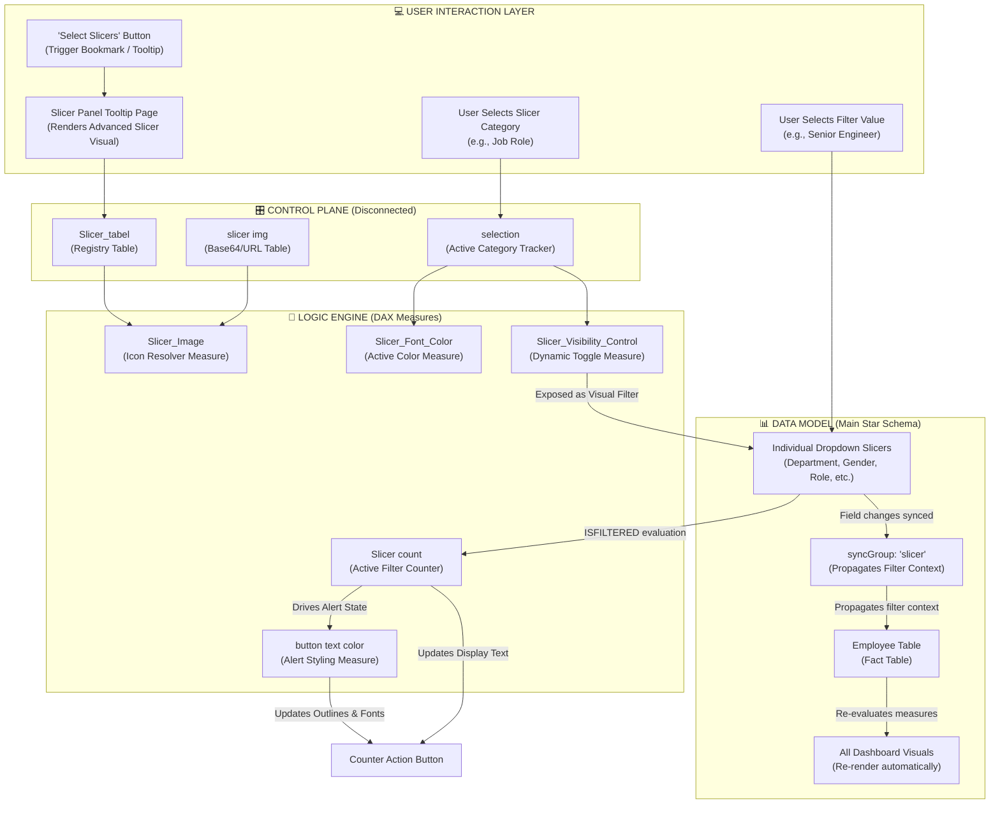
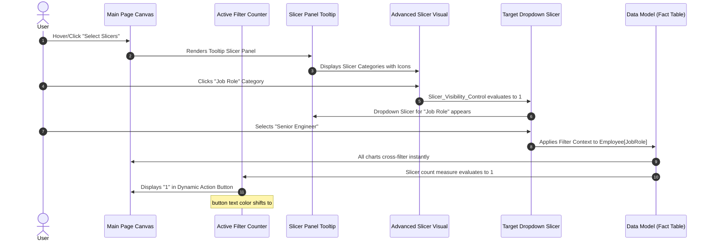

# 🎛️ Advanced Dynamic Filtering System — Technical Reference

> **The primary selling point of this repository is the custom-engineered Dynamic Filtering System. Rather than relying on default Power BI slicer layouts, this dashboard utilizes a disconnected table architecture, dynamic state measures, and cross-page synchronization to deliver a premium, web-app-like user experience.**

---

## 1. System Architecture

The Dynamic Filtering System operates as a separate control plane decoupled from the data model's main relational join paths. Below is the data-flow and logic-flow diagram showing how the user's interaction propagates through the system.



---

## 2. Disconnected Table Pattern

The foundation of this system is the `Slicer_tabel` (and its supporting tables `slicer img` and `selection`). 

Unlike standard dimension tables, the `Slicer_tabel` is **disconnected**—it has no physical relationships (active or inactive) to the `Employee` fact table. This is critical: if a relationship existed, selecting a category in the slicer panel would instantly filter the employee data itself, rather than acting as a metadata toggle to control which slicer is visible.

### Slicer Registry Structure (`Slicer_tabel`)
The table acts as a registry of all interactive slicer categories:

| Index | slicer (Category Name) | Category Label | Image ID |
|-------|------------------------|----------------|----------|
| 1     | Department             | Department     | IMG_DEPT |
| 2     | Gender                 | Gender         | IMG_GEN  |
| 3     | JobRole                | Job Role       | IMG_ROLE |
| 4     | BusinessTravel         | Travel Status  | IMG_TRAV |
| 5     | MaritalStatus          | Marital Status | IMG_MARR |
| 6     | Salary                 | Salary Range   | IMG_SAL  |
| 7     | State                  | State/Location | IMG_LOC  |

---

## 3. Logic Engine (DAX Measures)

Seven specialized DAX measures coordinate the state, appearance, and feedback of the filtering interface. Below are the technical explanations and formulas for these measures:

### A. `Slicer_Visibility_Control` [Inferred]
This measure controls which slicer visual is rendered. It is applied as a visual-level filter on each individual slicer, set to `Slicer_Visibility_Control = 1`.

```dax
Slicer_Visibility_Control = 
VAR SelectedCategory = SELECTEDVALUE('Slicer_tabel'[slicer])
VAR CurrentVisualCategory = MAX('selection'[Selected Slicer])
RETURN
    IF(SelectedCategory = CurrentVisualCategory, 1, 0)
```
*   **How it works**: When a user selects a category (e.g., "JobRole") in the advanced slicer, the `selection` table updates. The measure evaluates each slicer's boundary condition. The JobRole dropdown slicer evaluates to `1` and displays; all other dropdowns evaluate to `0` and are hidden from view.

### B. `Slicer_Image` [Inferred]
Resolves the dynamic icon for the Advanced Slicer Visual.

```dax
Slicer_Image = 
VAR CurrentCategory = SELECTEDVALUE('Slicer_tabel'[slicer])
RETURN
    LOOKUPVALUE('slicer img'[Image_URL], 'slicer img'[Image_ID], SELECTEDVALUE('Slicer_tabel'[Image_ID]))
```
*   **How it works**: Dynamically returns the Base64 image string or asset URL for the active category row, allowing the Advanced Slicer to display rich icons (briefcase, globe, etc.) next to the text.

### C. `Slicer_Font_Color` [Inferred]
Applies conditional formatting to the text labels inside the slicer panel.

```dax
Slicer_Font_Color = 
VAR ActiveSelection = SELECTEDVALUE('Slicer_tabel'[slicer])
VAR CurrentState = SELECTEDVALUE('selection'[Selected Slicer])
RETURN
    IF(ActiveSelection = CurrentState, "#5E14C6", "#6E6E6E")
```
*   **How it works**: If a category is selected, its text shifts to the primary deep purple (`#5E14C6`). Unselected categories remain a muted gray (`#6E6E6E`), creating clear visual hierarchy.

### D. `Slicer count` [Inferred]
Determines the number of active filters. This drives the value shown on the Action Button.

```dax
Slicer count = 
VAR DepartmentFilter = IF(ISFILTERED('Employee'[Department]), 1, 0)
VAR GenderFilter = IF(ISFILTERED('Employee'[Gender]), 1, 0)
VAR JobRoleFilter = IF(ISFILTERED('Employee'[JobRole]), 1, 0)
VAR TravelFilter = IF(ISFILTERED('Employee'[BusinessTravel]), 1, 0)
VAR MaritalFilter = IF(ISFILTERED('Employee'[MaritalStatus]), 1, 0)
VAR SalaryFilter = IF(ISFILTERED('Employee'[Salary]), 1, 0)
VAR StateFilter = IF(ISFILTERED('Employee'[State]), 1, 0)
RETURN
    DepartmentFilter + GenderFilter + JobRoleFilter + TravelFilter + MaritalFilter + SalaryFilter + StateFilter
```
*   **How it works**: Uses `ISFILTERED` to evaluate if the filter context of the `Employee` table has been narrowed down by any of the 7 slicers. It sums these boolean states to return a single count (0 to 7).

### E. `button text color` [Inferred]
Provides visual feedback on the active filter state by changing the counter button's font, outline, and shadow color.

```dax
button text color = 
IF([Slicer count] > 0, "#5D14C3", "#AC8AE0")
```
*   **How it works**: If no filters are active (`Slicer count = 0`), the counter text and border render in light purple (`#AC8AE0`). The moment a filter is selected, the color changes to deep accent purple (`#5D14C3`), drawing the user's attention.

---

## 4. User Interaction Flow

The interaction sequence below details how state propagates from the user's cursor to the database query engine.



---

## 5. Filter Context vs. Evaluation Context

Understanding how the Dynamic Filtering System works requires analyzing the distinction between **Filter Context** and **Evaluation Context** in this specific design:

### Filter Context
*   The filter context is the set of active filters applied to the data model.
*   When a user selects "Senior Engineer" in the Job Role slicer, that value is injected into the filter context. Because of the **syncGroup "slicer"**, this filter context is synchronized between the Tooltip page and the Main page.
*   This context propagates from the `Employee` table across all visuals since they have `drillFilterOtherVisuals` enabled. VertiPaq filters the data segment before calculating aggregations like `Count of EmployeeID`.

### Evaluation Context
*   The evaluation context refers to the environment in which DAX measures are calculated.
*   For the measure `Slicer count`, the evaluation context consists of the current filters on the page. Because the user selected "Senior Engineer", `ISFILTERED(Employee[JobRole])` evaluates to `TRUE` (1), while all other columns evaluate to `FALSE` (0).
*   For the measure `Slicer_Visibility_Control`, the evaluation context is driven by the row context of the Advanced Slicer Visual (which iterates over the `Slicer_tabel` rows) transformed into filter context. The measure checks if the row being rendered matches the value stored in the `selection` state table, determining whether to return `1` or `0`.

---

## 6. Performance & Optimization

Custom filter architectures can introduce performance overhead if not properly optimized. The Tesla Employee Insights dashboard implements several optimization techniques:

### 1. Minimal Slicer Table Footprint
The `Slicer_tabel` is a low-cardinality control table (7 rows). Disconnected tables of this size reside entirely in L1 cache during DAX evaluation, resulting in sub-millisecond execution times for `Slicer_Visibility_Control` and `Slicer_Image`.

### 2. VertiPaq-Friendly Slicer Counting
The `Slicer count` measure utilizes `ISFILTERED` rather than counting rows in filtered tables (e.g., `COUNTROWS(VALUES(...))`). `ISFILTERED` is a metadata-only check in Power BI, meaning it does not query the actual data engine or materialise tables, keeping memory consumption near zero.

### 3. Sync Group Optimization
The sync group `"slicer"` is configured to sync only the field and filter selections. It does not sync visual formatting or layout properties, reducing the size of the report definition metadata JSON and improving page load speeds.

### 4. Grouped Visual Refresh
Grouping visuals into sections (such as `"Bar chart"` and `"Pie"`) allows Power BI's layout engine to optimize query batching. When cross-filtering occurs, Power BI groups queries for visuals in the same layout hierarchy, reducing the number of roundtrips to the VertiPaq engine.
