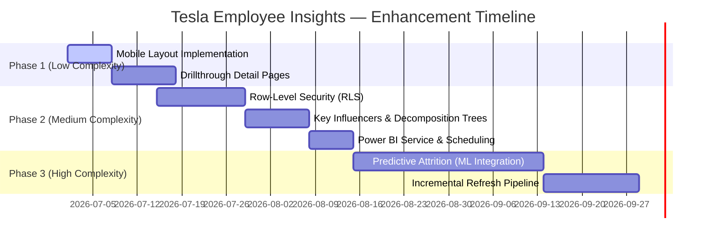

# 🔮 Roadmap & Future Enhancements

This document outlines the strategic roadmap for the **Tesla Employee Insights Dashboard**, categorizing future enhancements by their implementation complexity, business value, and technical execution steps.

---

## 🚀 Future Enhancements Roadmap



---

## 1. 🧠 Predictive Attrition (Machine Learning Integration)

*   **Complexity Level**: 🔴 High
*   **Business Value**: ⭐⭐⭐⭐⭐ (Transforms dashboard from descriptive/diagnostic to predictive)
*   **Target Completion**: 30 Days

### Description
Integrate a predictive machine learning model to calculate an "Attrition Risk Score" (0–100%) for each active employee. This score will be written back to the data source and exposed in the dashboard as a leading indicator, allowing HR to proactively engage high-risk, high-value individuals.

### Implementation Steps
1.  **Model Training**: Train a binary classification model (e.g., XGBoost or Random Forest) using historical employee records. Key features will include `OverTime`, `Salary`, `JobRole`, `Department`, and `JobSatisfaction`.
2.  **Azure Machine Learning Integration**: Host the trained model on Azure ML.
3.  **Power BI Data Flow Integration**: Use the built-in Power BI Azure ML integration to score the dataset during scheduled refreshes.
4.  **UI Exposure**: Add an "Attrition Risk Band" (High, Medium, Low) to the Employee table and create a new risk analysis visual group on the dashboard.

### Business Value
Reduces voluntary attrition costs by identifying retention risks *before* employees submit resignations, enabling timely retention bonuses or role adjustments.

---

## 🤖 2. Advanced AI Visuals (Key Influencers & Decomposition Tree)

*   **Complexity Level**: 🟡 Medium
*   **Business Value**: ⭐⭐⭐⭐ (Automates root-cause discovery for business users)
*   **Target Completion**: 10 Days

### Description
Incorporate native Power BI AI visuals to allow users to ask open-ended questions about the workforce without needing statistical training.

### Key Influencers Visual
*   **Setup**: Configure the visual to explain `Attrition` (Yes/No) based on all available demographics (`Department`, `OverTime`, `Salary Range`, `MaritalStatus`, `BusinessTravel`).
*   **Value**: Instantly shows the mathematical drivers of attrition (e.g., "Employees who work overtime are 3.2x more likely to leave").

### Decomposition Tree Visual
*   **Setup**: Set the target metric to `EmployeeID (Count)` and allow decomposition by `Department` → `JobRole` → `Attrition` → `OverTime`.
*   **Value**: Enables interactive path analysis to trace where resource concentrations or high departures exist down to specific roles.

---

## 🔒 3. Enterprise Row-Level Security (RLS)

*   **Complexity Level**: 🟡 Medium
*   **Business Value**: ⭐⭐⭐⭐⭐ (Mandatory for production HR deployments)
*   **Target Completion**: 14 Days

### Description
Implement static and dynamic security roles to ensure users only view data they are authorized to see based on their organizational position.

### Roles Defined
*   **HR Business Partners**: Restricted to view data for their assigned `Department` (e.g., the Engineering HRBP only sees Engineering staff).
*   **Regional Managers**: Restricted to view employee data matching their assigned `State` (e.g., California Operations Director only sees CA records).
*   **HR Executive / CHRO**: Unrestricted access to the entire model.

### DAX Filter Expressions
*   **Departmental Role (`DepartmentalBP`)**:
    ```dax
    'Employee'[Department] = LOOKUPVALUE('SecurityAccess'[Department], 'SecurityAccess'[UserEmail], USERPRINCIPALNAME())
    ```
*   **Regional Role (`RegionalDirector`)**:
    ```dax
    'Employee'[State] = LOOKUPVALUE('SecurityAccess'[State], 'SecurityAccess'[UserEmail], USERPRINCIPALNAME())
    ```

---

## ☁️ 4. Power BI Service Deployment & Collaboration

*   **Complexity Level**: 🟡 Medium
*   **Business Value**: ⭐⭐⭐⭐ (Enables scaling, scheduling, and central governance)
*   **Target Completion**: 7 Days

### Description
Publish the report from Power BI Desktop to a secured Workspace in the Power BI Service, establishing automated refresh pipelines and packaging it for enterprise consumption.

### Execution Steps
1.  **Workspace Creation**: Provision an Azure AD-secured Power BI Workspace.
2.  **Gateway Configuration**: Set up an On-Premises Data Gateway or configure Azure SQL Cloud database credentials.
3.  **Scheduled Refresh**: Configure a refresh schedule (e.g., 4x daily to sync with shift changes).
4.  **App Publishing**: Package the dashboard and documentation into a Power BI App, managing access via AD Security Groups.

---

## ⚡ 5. Incremental Refresh Pipeline

*   **Complexity Level**: 🔴 High
*   **Business Value**: ⭐⭐⭐ (Reduces server load and database read locks)
*   **Target Completion**: 15 Days

### Description
Transition from full partition refreshes to incremental partition updates using Power BI's `RangeStart` and `RangeEnd` parameters.

### Execution Steps
1.  **Define Parameters**: Create datetime parameters `RangeStart` and `RangeEnd` in Power Query.
2.  **Filter Source**: Filter the `Employee[HireDate]` table using these parameters.
3.  **Incremental Policy**: Set the refresh policy in Power BI Desktop (e.g., Retain historical data for 5 Years; Refresh incremental data for 30 Days).
4.  **Deployment**: Publish to Power BI Premium or Fabric capacity to instantiate partitioning.

---

## 📱 6. Mobile-Optimized Layouts

*   **Complexity Level**: 🟢 Low
*   **Business Value**: ⭐⭐⭐ (Improves field accessibility for executives)
*   **Target Completion**: 7 Days

### Description
Design a dedicated portrait-mode mobile view inside Power BI Desktop to support executives viewing the report on mobile phones or tablets.

### Implementation Steps
1.  Switch to the **Mobile Layout** canvas in Power BI Desktop.
2.  Rearrange the visuals into a vertical, single-column scrollable grid:
    *   *Top Slot*: Active Filter Counter & Select Slicers button.
    *   *Slot 2*: Attrition Pie Chart.
    *   *Slot 3*: Overtime Donut Chart.
    *   *Slot 4*: Salary Distribution Bar Chart.
    *   *Slot 5*: Hiring Trend Line Chart.
3.  Adjust visual formatting (e.g., reduce padding, resize font labels) specifically for mobile view ports.

---

## 📑 7. Drillthrough Detail Pages

*   **Complexity Level**: 🟢 Low
*   **Business Value**: ⭐⭐⭐⭐ (Transitions from summary metrics to operational action)
*   **Target Completion**: 10 Days

### Description
Develop a hidden detail page containing a tabular view of employee details (Name, ID, Department, Specific Salary, Manager, Tenures). Users can right-click any data point in the main page's charts (e.g., departed Software Engineers) and drill through to view the exact employee records driving that metric.

### Implementation Steps
1.  Create a new page titled `Employee Detail List`.
2.  Expose `Employee[Attrition]`, `Employee[Department]`, and `Employee[JobRole]` as drillthrough fields.
3.  Renders a table visual listing granular attributes of the filtered population.
4.  Add a standard Power BI back button for navigation back to the main summary page.
