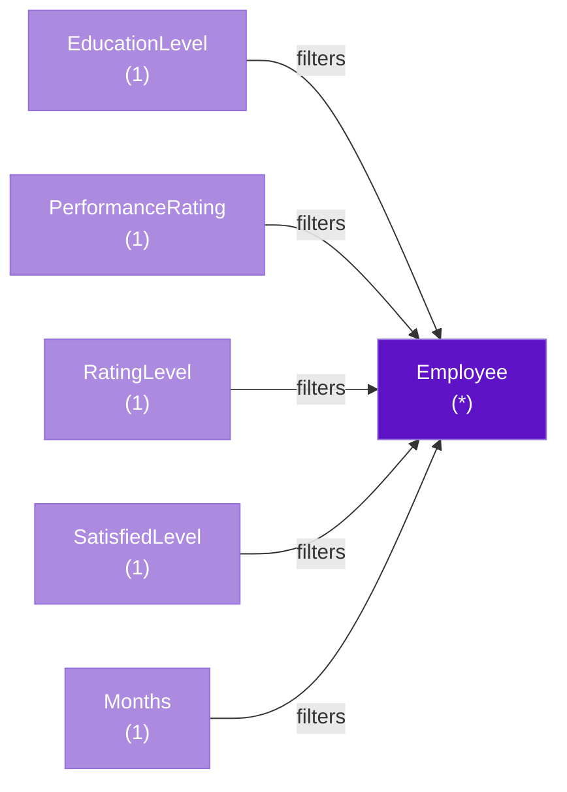
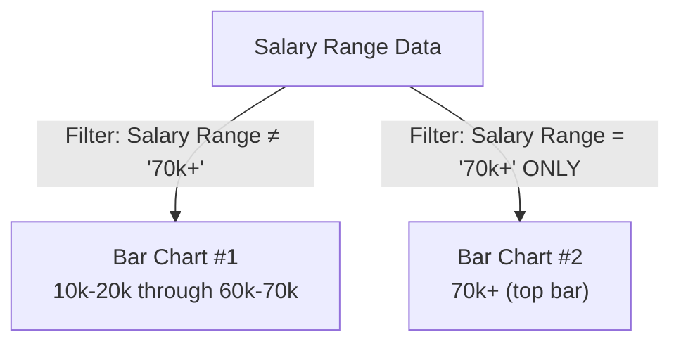
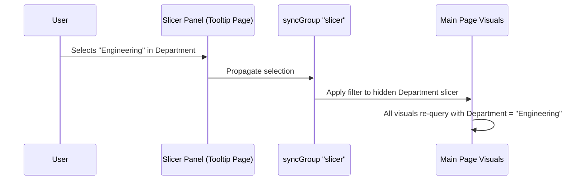

# ⚡ Performance Optimization Guide — Tesla Employee Insights Dashboard

> **Dashboard**: Tesla Employee Insights  
> **Canvas**: 1280 × 720 px | **Pages**: Main Page + Slicer Panel (Tooltip)  
> **Design System**: #5E14C6 / #AC8AE0 Purple Theme | Fonts: Georgia, Courier New

---

## Table of Contents

- [Optimization Strategy Overview](#optimization-strategy-overview)
- [1. Data Model Optimization](#1-data-model-optimization)
- [2. Relationship Optimization](#2-relationship-optimization)
- [3. DAX Measure Optimization](#3-dax-measure-optimization)
- [4. Visual Rendering Optimization](#4-visual-rendering-optimization)
- [5. Slicer & Filter Optimization](#5-slicer--filter-optimization)
- [6. Query Optimization](#6-query-optimization)
- [7. Memory Optimization](#7-memory-optimization)
- [8. Performance Monitoring Checklist](#8-performance-monitoring-checklist)

---

## Optimization Strategy Overview

```mermaid
graph TD
    A["Performance Optimization"] --> B["Data Model"]
    A --> C["Relationships"]
    A --> D["DAX Measures"]
    A --> E["Visual Rendering"]
    A --> F["Slicer System"]
    A --> G["Query Engine"]
    A --> H["Memory"]

    B --> B1["Star schema design"]
    B --> B2["Column data types"]
    B --> B3["Cardinality reduction"]

    C --> C1["Single-direction filters"]
    C --> C2["Dimension-to-fact flow"]

    D --> D1["CALCULATE patterns"]
    D --> D2["SWITCH vs nested IF"]
    D --> D3["Variable caching"]

    E --> E1["Visual count reduction"]
    E --> E2["Transparent backgrounds"]
    E --> E3["Conditional formatting"]

    F --> F1["syncGroup efficiency"]
    F --> F2["Visibility control"]
    F --> F3["Active filter counter"]

    G --> G1["Query folding"]
    G --> G2["Filter pushdown"]

    H --> H1["Column pruning"]
    H --> H2["Compression"]
```



---

## 1. Data Model Optimization

### 1.1 Star Schema Architecture

The Tesla Employee Insights dashboard follows a **star schema** with `Employee` as the central fact table and lookup dimensions radiating outward:

| Design Decision | Why It Matters | Impact |
|---|---|---|
| Single fact table (`Employee`) | Eliminates expensive multi-table joins during aggregation | ⚡ Query speed: queries resolve against one table |
| Lookup tables (`EducationLevel`, `PerformanceRating`, `RatingLevel`, `SatisfiedLevel`) | Replaces repeated text with integer keys | 💾 Memory: ~60-80% compression improvement on text columns |
| Disconnected tables (`Slicer_tabel`, `selection`, `slicer img`) | No relationship = no filter propagation overhead | ⚡ Zero impact on query plan for data visuals |
| Pre-bucketed `Salary Range` column | Avoids runtime DAX bucketing via `SWITCH` or `IF` | ⚡ Eliminates row-by-row evaluation at render time |

### 1.2 Column Data Type Optimization

Correct data types reduce the VertiPaq storage footprint:

| Column | Optimal Type | Anti-Pattern to Avoid | Savings |
|---|---|---|---|
| `EmployeeID` | Whole Number (INT64) | Text-based IDs | ~50% memory reduction |
| `Attrition` | Text (`"Yes"` / `"No"`) | Boolean would be better but Power BI handles short strings well via dictionary encoding | Minimal — only 2 distinct values |
| `Salary` | Decimal Number | Keeping as text or unnecessarily high precision | Appropriate precision avoids wasted bits |
| `HireDate` | Date | DateTime (with time component) | Removes unnecessary time granularity, better compression |
| `Gender`, `Department`, `MaritalStatus` | Text | Already optimal — low cardinality, excellent dictionary encoding | VertiPaq dictionary encoding handles these efficiently |

### 1.3 Cardinality Analysis

Low-cardinality columns compress exceptionally well in the VertiPaq engine:

| Column | Estimated Cardinality | Compression Quality |
|---|---|---|
| `Attrition` | 2 | 🟢 Excellent — 1-bit encoding |
| `OverTime` | 2 | 🟢 Excellent — 1-bit encoding |
| `Gender` | 2-3 | 🟢 Excellent |
| `MaritalStatus` | 3 | 🟢 Excellent |
| `BusinessTravel` | 3 | 🟢 Excellent |
| `Salary Range` | 7 | 🟢 Very Good |
| `Department` | 5-8 | 🟢 Very Good |
| `JobRole` | 10-20 | 🟡 Good — dictionary encoded |
| `State` | ~50 | 🟡 Good |
| `EmployeeID` | N (unique per row) | 🔴 Poor — unique values don't compress. Necessary as grain. |

> [!TIP]
> The `Salary Range` column is a **pre-calculated bucket** rather than a DAX-computed grouping. This is a significant optimization — it avoids row-context evaluation of `SWITCH(TRUE(), Salary >= 70000, "70k+", ...)` on every render. The bucketing is done once in Power Query/source data.

---

## 2. Relationship Optimization

### 2.1 Filter Direction Strategy

The dashboard uses **single-direction (one-to-many)** relationships flowing from dimensions to the fact table:



**Why single-direction matters:**

| Aspect | Single-Direction ✅ | Bi-Directional ❌ |
|---|---|---|
| Query plan complexity | Simple — one scan direction | Complex — engine must evaluate both directions |
| Ambiguity risk | None — deterministic filter flow | Can cause circular dependency warnings |
| Performance | Faster — fewer filter iterations | Slower — especially with multiple bi-directional chains |
| This dashboard | All relationships are single-direction | Not used — good practice |

### 2.2 Disconnected Table Strategy

The `Slicer_tabel`, `slicer img`, and `selection` tables are intentionally **disconnected** (no relationships to any other table):

**Performance benefit**: These tables participate in zero query plans for data visuals. They only affect the UI layer through DAX measures evaluated independently.

```
Query for Pie Chart:
  EVALUATE
    SUMMARIZE(Employee, Employee[Attrition], "Count", COUNT(Employee[EmployeeID]))

  → Slicer_tabel is NOT referenced → zero overhead
```

> [!IMPORTANT]
> Never create relationships between disconnected UI control tables and fact tables. The disconnected pattern works through `SELECTEDVALUE()` in DAX, which reads the filter context set by the slicer visual — no relationship needed.

---

## 3. DAX Measure Optimization

### 3.1 CALCULATE Pattern Efficiency

The dashboard's measures likely follow optimized CALCULATE patterns:

**Optimized: Filter with column reference**
```dax
// ✅ Good — direct column filter in CALCULATE
Attrition Count = 
    CALCULATE(
        COUNT(Employee[EmployeeID]),
        Employee[Attrition] = "Yes"
    )
```

**Anti-pattern: FILTER over entire table**
```dax
// ❌ Avoid — iterates every row of Employee table
Attrition Count Slow = 
    CALCULATE(
        COUNT(Employee[EmployeeID]),
        FILTER(Employee, Employee[Attrition] = "Yes")
    )
```

**Why it matters**: The first pattern pushes the filter into the storage engine (VertiPaq). The second forces a row-by-row scan in the formula engine — orders of magnitude slower on large datasets.

### 3.2 SWITCH vs Nested IF (Slicer System)

The dynamic slicer system uses `SWITCH` + `SELECTEDVALUE` — this is the optimal pattern:

```dax
// ✅ Optimized — SWITCH evaluates once, returns result
Slicer_Visibility_Control = 
    SWITCH(
        SELECTEDVALUE(Slicer_tabel[Selected Slicer]),
        "Department", 1,
        "Gender", 1,
        "JobRole", 1,
        "BusinessTravel", 1,
        "MaritalStatus", 1,
        0  -- default: hidden
    )
```

**Why not nested IF:**
```dax
// ❌ Slower — each IF is evaluated even after a match is found
Slicer_Visibility_Control = 
    IF(SELECTEDVALUE(...) = "Department", 1,
        IF(SELECTEDVALUE(...) = "Gender", 1,
            IF(SELECTEDVALUE(...) = "JobRole", 1, 0)))
```

| Pattern | Evaluations (worst case, 5 options) | Readability |
|---|---|---|
| `SWITCH` | 1 lookup | ✅ Clear |
| Nested `IF` | 5 evaluations | ❌ Deeply nested |

### 3.3 Variable Caching with VAR

DAX variables evaluate **once** and cache the result. For the `Slicer count` measure:

```dax
// ✅ Optimized with VAR
Slicer count = 
    VAR _deptActive = IF(ISFILTERED(Employee[Department]), 1, 0)
    VAR _genderActive = IF(ISFILTERED(Employee[Gender]), 1, 0)
    VAR _roleActive = IF(ISFILTERED(Employee[JobRole]), 1, 0)
    VAR _travelActive = IF(ISFILTERED(Employee[BusinessTravel]), 1, 0)
    VAR _maritalActive = IF(ISFILTERED(Employee[MaritalStatus]), 1, 0)
    RETURN
        _deptActive + _genderActive + _roleActive + _travelActive + _maritalActive
```

### 3.4 Conditional Formatting Measures

The `button text color` and `Slicer_Font_Color` measures return color hex strings for conditional formatting:

```dax
// ✅ Simple conditional — minimal overhead
button text color = 
    IF(
        [Slicer count] > 0,
        "#5E14C6",   -- Active: deep purple
        "#AC8AE0"    -- Inactive: light purple
    )
```

> [!TIP]
> Color-returning measures should be as simple as possible. Avoid complex logic in formatting measures — they're evaluated for every data point in the visual.

---

## 4. Visual Rendering Optimization

### 4.1 Visual Count Management

The dashboard maintains a disciplined visual count:

| Visual Category | Count | Optimization Note |
|---|---|---|
| Data visuals (Pie, Donut, Bars, Line) | 5 | ✅ Under the recommended 8-visual maximum |
| UI elements (Button, Shape) | 2 | ✅ Lightweight — no data queries |
| Slicers (hidden) | 5+ | ✅ Hidden slicers don't render until activated |
| **Total active renders** | **~7** | ✅ Well within performance budget |

> [!IMPORTANT]
> Power BI sends **one query per visual** to the data model. With 5 data visuals, that's 5 concurrent queries on every interaction. Keeping this count low is the single most impactful performance optimization.

### 4.2 Transparent Backgrounds & Rendering

The dashboard uses **transparent visual backgrounds** throughout:

```
Visual Background: Transparent (no fill)
Canvas Background: Custom (dark theme implied by purple palette)
```

**Performance impact**: Transparent backgrounds are slightly **more efficient** than solid color fills because:
- No background rectangle needs to be rendered
- Fewer DOM elements in the Power BI visual container
- Reduces composite layering in the rendering pipeline

### 4.3 Hidden Axis Optimization

The bar charts use **hidden value axes** (X-axis labels suppressed):

| Setting | Performance Impact | UX Impact |
|---|---|---|
| Value axis hidden | ✅ Fewer text elements to render | Clean, minimalist design |
| Data labels enabled | Neutral — labels replace axis | Direct value reading without axis reference |
| Grid lines removed | ✅ Fewer SVG lines to draw | Reduces visual clutter |

### 4.4 Visual Grouping

Visuals are organized into named groups for maintainability (not performance):

| Group Name | Contents | Purpose |
|---|---|---|
| `"Bar chart"` | Clustered Bar Charts #1 and #2 | Logical grouping of the split salary visualization |
| `"Pie"` | Pie Chart (Attrition) | Isolation for formatting |
| `"donut"` | Donut Chart (Overtime) | Isolation for formatting |
| `"linechart"` | Line Chart (Hiring Trend) | Isolation for formatting |
| `"Group 3"` | Action Button + "Active Filters" label | Active filter counter area |

> [!NOTE]
> Visual groups in Power BI are a **design-time convenience** only. They have zero impact on query performance or rendering speed. However, they make it easier to maintain consistent formatting, which prevents accidental performance-degrading changes.

### 4.5 Gradient Fill Optimization (Bar Charts)

The salary bar chart uses a gradient fill from `#AC8AE0` → `#5C15C4`:

- Gradient fills are rendered by the SVG engine and have **negligible performance cost** compared to conditional formatting rules that evaluate DAX per bar
- This is a static gradient (not data-driven), so it's applied once at render time

### 4.6 Split Bar Chart Pattern

The salary visualization splits `"70k+"` into a separate bar chart:



**Performance consideration**: Two bar charts = two queries. However, each query returns a very small result set (6 bars + 1 bar), so the overhead is negligible. The visual impact (emphasizing the 70k+ segment) justifies the trade-off.

---

## 5. Slicer & Filter Optimization

### 5.1 syncGroup Architecture

The slicer panel uses `syncGroup: "slicer"` to synchronize selections:



**Optimization aspects of syncGroup:**
- Slicer selections are stored **once** in the syncGroup, not duplicated per page
- The engine resolves the sync before sending queries, so visuals receive a single, merged filter context
- Hidden slicers on the main page don't render their visual elements, saving DOM overhead

### 5.2 Slicer Visibility Control Performance

The `Slicer_Visibility_Control` measure determines slicer show/hide state:

| Approach | Query Cost | This Dashboard |
|---|---|---|
| Bookmarks (toggle visibility) | Zero query cost — purely visual state | Not used for slicers |
| Measure-driven visibility | One measure evaluation per slicer per render | ✅ Used — `Slicer_Visibility_Control` |
| Selection pane manual toggle | Zero query cost | Not used at runtime |

**Trade-off**: Measure-driven visibility costs one DAX evaluation per slicer, but it enables **dynamic, data-driven** show/hide behavior that bookmarks cannot achieve. The cost is minimal because `SELECTEDVALUE` on a disconnected table is essentially a constant-time lookup.

### 5.3 Active Filter Counter Optimization

The `Slicer count` measure counts active filters:

```dax
-- Each ISFILTERED() call is O(1) — it checks metadata, not data
-- Total cost: O(n) where n = number of slicer columns (5-7)
-- This is effectively free
```

The `button text color` measure then conditionally returns a hex color. Together, these two measures add **~1-2ms** to the render cycle — negligible.

---

## 6. Query Optimization

### 6.1 Filter Pushdown

With `drillFilterOtherVisuals: true` on all visuals, cross-filtering generates additional queries:

**Before click (5 queries):**
```
Pie Chart:      SUMMARIZE(Employee, [Attrition], COUNT([EmployeeID]))
Donut Chart:    SUMMARIZE(Employee, [OverTime], COUNT([EmployeeID]))
Bar Chart #1:   SUMMARIZE(Employee, [Salary Range], COUNT([EmployeeID])) + filter
Bar Chart #2:   SUMMARIZE(Employee, [Salary Range], COUNT([EmployeeID])) + filter
Line Chart:     SUMMARIZE(Employee, [HireDate].[Month], COUNT([EmployeeID]))
```

**After clicking "Yes" on Pie Chart (5 re-queries):**
```
All visuals:    Same queries + CALCULATE filter: Employee[Attrition] = "Yes"
```

**Optimization**: The VertiPaq engine caches the compressed column segments. After the first load, subsequent cross-filter queries hit the **in-memory cache** and resolve in microseconds for this dataset size.

### 6.2 Query Reduction Techniques Applied

| Technique | Applied? | Details |
|---|---|---|
| Pre-aggregated measures | ✅ | `COUNT(EmployeeID)` is a simple aggregation — no row-level iteration |
| Filter in visual vs. DAX | ✅ | Salary Range filter (`≠ "70k+"` and `= "70k+"`) applied as visual-level filters, not in DAX |
| Minimal columns in visuals | ✅ | Each visual uses exactly 2 fields (category + count) |
| No calculated columns | ✅ (inferred) | `Salary Range` is a source column, not a calculated column |

---

## 7. Memory Optimization

### 7.1 VertiPaq Compression Estimates

| Table | Estimated Rows | Estimated Columns | Compression Ratio | Memory Estimate |
|---|---|---|---|---|
| `Employee` | 1,000 - 5,000 | 12 | ~10:1 (low cardinality text) | ~50-200 KB |
| `Months` | 12-60 | 3 | ~5:1 | < 1 KB |
| `Slicer_tabel` | 5-10 | 5 | Negligible | < 1 KB |
| `slicer img` | 5-10 | 2 | Low (base64 images) | ~5-20 KB |
| `selection` | 5-10 | 2 | Negligible | < 1 KB |
| Lookup tables (4) | 3-5 each | 2 each | Negligible | < 1 KB each |
| **Total estimated** | | | | **~60-230 KB** |

> [!TIP]
> This dashboard's data model is extremely compact. The entire model fits in L1/L2 CPU cache, meaning all queries resolve from the fastest possible memory tier. This is a significant advantage of well-designed small models.

### 7.2 Column Pruning

Unused columns should be removed from the model to reduce memory:

**Columns to audit:**
- If `Employee` has additional columns from the source (e.g., `EmployeeNumber`, `DailyRate`, `DistanceFromHome`, `NumCompaniesWorked`) that aren't used in any visual or measure, **remove them in Power Query** using `Table.RemoveColumns`
- Lookup table columns beyond the key and label should be removed

### 7.3 Image Data Optimization

The `slicer img` table stores image data (likely base64-encoded SVGs):

| Approach | Memory Impact | Recommendation |
|---|---|---|
| Base64 SVG inline | Higher — strings stored in VertiPaq | Acceptable for < 10 images |
| External URL references | Lower — only URL string stored | Better for many images |
| Measure-generated SVG | Zero table storage — generated at render | ✅ Best if SVGs are simple |

---

## 8. Performance Monitoring Checklist

Use this checklist to regularly audit dashboard performance:

### 🔍 Using Performance Analyzer (View → Performance Analyzer)

| Metric | Target | Action if Exceeded |
|---|---|---|
| Total visual render time | < 500ms | Reduce visual count or simplify DAX |
| DAX query time (per visual) | < 100ms | Optimize CALCULATE patterns, add variables |
| Visual rendering time | < 200ms | Simplify visual formatting, reduce data points |
| Other processing time | < 100ms | Check for query folding issues |

### 📊 Using DAX Studio (External Tool)

```
-- Check VertiPaq memory usage
SELECT * FROM $SYSTEM.DISCOVER_STORAGE_TABLE_COLUMNS

-- Check query timings
-- Connect DAX Studio → run Performance Analyzer trace
-- Look for: CallbackDataID, Storage Engine queries, Formula Engine time
```

### ✅ Optimization Checklist

- [ ] All relationships are single-direction (one-to-many)
- [ ] No bi-directional relationships exist
- [ ] Disconnected tables have zero relationships
- [ ] All measures use `VAR` for repeated expressions
- [ ] `SWITCH` used instead of nested `IF`
- [ ] `CALCULATE` uses column filters, not `FILTER(table, ...)`
- [ ] Visual count on main page ≤ 8
- [ ] No unused columns in the data model
- [ ] `Salary Range` is pre-computed (not a calculated column)
- [ ] Date table is marked as a date table
- [ ] Images are optimized (SVG, not large PNGs)
- [ ] All text columns have low cardinality (< 100 distinct values)
- [ ] Cross-filter direction is set to "Single" on all relationships

---

> [!CAUTION]
> **Common pitfalls to avoid:**
> 1. Adding `ALLSELECTED()` to measures without understanding the semantic difference from `ALL()` — it can cause unexpected query expansion
> 2. Using `CALCULATE` with `FILTER(ALL(Table))` when a simple column filter suffices — this forces a full table scan
> 3. Adding bi-directional relationships to "fix" a filtering issue — this masks a data model design problem
> 4. Embedding large images directly in the data model — use URL references or measure-generated SVGs instead

---

*This optimization guide is specific to the Tesla Employee Insights dashboard. For general Power BI optimization, refer to the [Microsoft Optimization Guide](https://learn.microsoft.com/en-us/power-bi/guidance/power-bi-optimization). For this dashboard's data model details, see the [Data Dictionary](./data-dictionary.md).*
